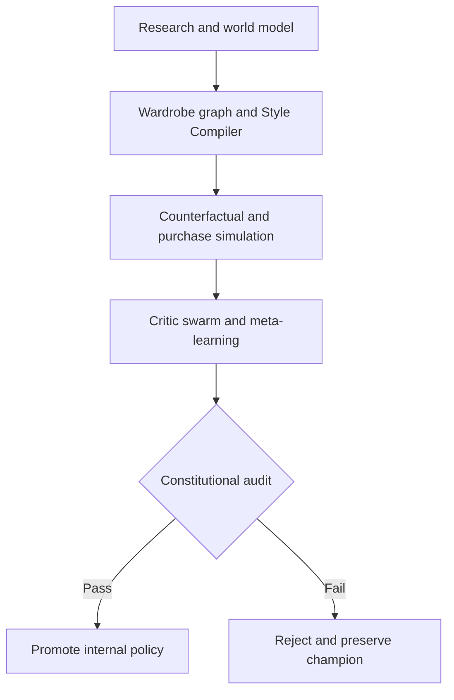

# Sovereign Closet — Fully Autonomous Iteration

Canonical repository: <https://github.com/Full-Stack-Assets-Enterprise/SovereignCloset>

This branch is the intentionally separate autonomous implementation of the Fashion Identity Ecosystem. It is not the bounded auto-promotion branch and shares no runtime state, promotion tables, or control-plane semantics with it.

The current vertical slice autonomously observes its authorized fashion world, discovers a wardrobe gap, compiles typed Style IR, compares controlled counterfactuals, simulates purchase impact, evaluates the evidence, mutates an internal policy genome, applies constitutional checks, and promotes the eligible challenger.

It remains a private, deterministic, non-billable proof. “Fully autonomous” currently means autonomous internal learning—not autonomous spending, messaging, publishing, deployment, or authority expansion.

## Run the branch

```bash
git switch iteration/fully-autonomous
npm run verify
npm start
```

Open `http://127.0.0.1:4173`, then select **Run autonomous cycle**.

## Public website build

```bash
npm run build:site
```

This produces `dist/site`, a GitHub Pages-ready version of the Observatory. When the private Node API is unavailable, the site automatically enters **Published Demo · Local Simulation** mode. Demo cycles run entirely inside the visitor's browser, persist only in local storage, and retain the same zero-provider, zero-cost, zero-transaction boundary.

The publication bundle contains the interface and approved structured fixture data only. It does not include SQLite state, uploaded identity photographs, credentials, or private project-source files.

The workflow at `.github/workflows/pages.yml` verifies the full test suite, builds the static bundle, and deploys it through GitHub Pages whenever `iteration/fully-autonomous` is pushed. See [docs/PUBLISHING.md](docs/PUBLISHING.md) for the one-time repository connection and Pages configuration.

## Autonomy Observatory

The violet/cyan interface provides five distinct views:

- **Observatory:** ten-agent topology, append-only cycle timeline, and visible constitutional envelope.
- **World Model:** typed beliefs, catalog/prompt/twin state, and the active wardrobe-gap hypothesis.
- **Evolution Lab:** active policy genome, five-module loop, counterfactual frontier, purchase simulation, and policy history.
- **Catalog:** structured clothing, footwear, accessory, and jewelry entities.
- **200 Seeds:** the immutable outfit corpus numbered 053 through 252.

## Cycle architecture



The ten persisted stages are `research`, `world-model`, `gap-analysis`, `style-compile`, `counterfactual`, `purchase-impact`, `critic-swarm`, `meta-learning`, `constitutional-audit`, and `promotion`.

## HTTP contracts

| Method | Route | Purpose |
|---|---|---|
| `GET` | `/api/health` | Branch, mode, and provider status |
| `GET` | `/api/autonomy/overview` | Current world, metrics, agents, policy, and latest cycle |
| `GET` | `/api/autonomy/cycles?limit=20` | Hydrated autonomous evidence history |
| `POST` | `/api/autonomy/cycles/run` | Run one constitutional internal-learning cycle |

The original catalog, prompt, progression, and prompt-composition endpoints remain available.

## Non-learnable constitution

- Preserve the same real adult identity; never recast, blend, age, or demographically drift it.
- Terminal gauges are exactly **5 inches**, using filled plugs or tunnels.
- Hair is short, dense black 360 waves; blonde or red detailing is not required.
- Preserve the established tattoo canon, `RARE ONE` back composition, facial hair, eyebrow slit, black rectangular glasses, nose piercing, signature chain, and pendant.
- Image contracts produce one standalone image—never a grid, collage, contact sheet, or multi-panel composition.
- Internal autonomy cannot transact, checkout, send offers/messages, publish, deploy, change credentials, spend, or expand its own authority.

## What this slice proves

- Autonomous-only persistence with policy lineage, cycles, events, beliefs, hypotheses, Style IR, counterfactuals, simulations, constitutional receipts, and recovery records.
- A deterministic ten-stage loop that can autonomously promote an internal challenger after a measurable utility gain.
- Typed evidence separating observations, beliefs, predictions, synthetic artifacts, counterfactuals, decisions, and constitutional facts.
- A complete UI and real HTTP contracts for observing and triggering the loop.
- Zero live provider calls, billable cost, transaction attempts, or external side effects.
- A publishable static runtime that demonstrates the full ten-stage loop without exposing the private control plane.

## Intentionally deferred

- Live research scanners and evolving external product ingestion.
- Paid image generation, private durable identity-reference storage, and automated visual critics.
- Real inventory, price, resale, commerce, calendar, weather, creator publishing, or spatial-computing integrations.
- Production authentication, workers, scheduling, cost enforcement, deployment, and public access.

See [the autonomous vertical-slice receipt](docs/AUTONOMOUS-VERTICAL-SLICE-RECEIPT.md) for exact verification evidence and [the autonomous design specification](docs/superpowers/specs/2026-08-29-fully-autonomous-design.md) for the long-term control model.
