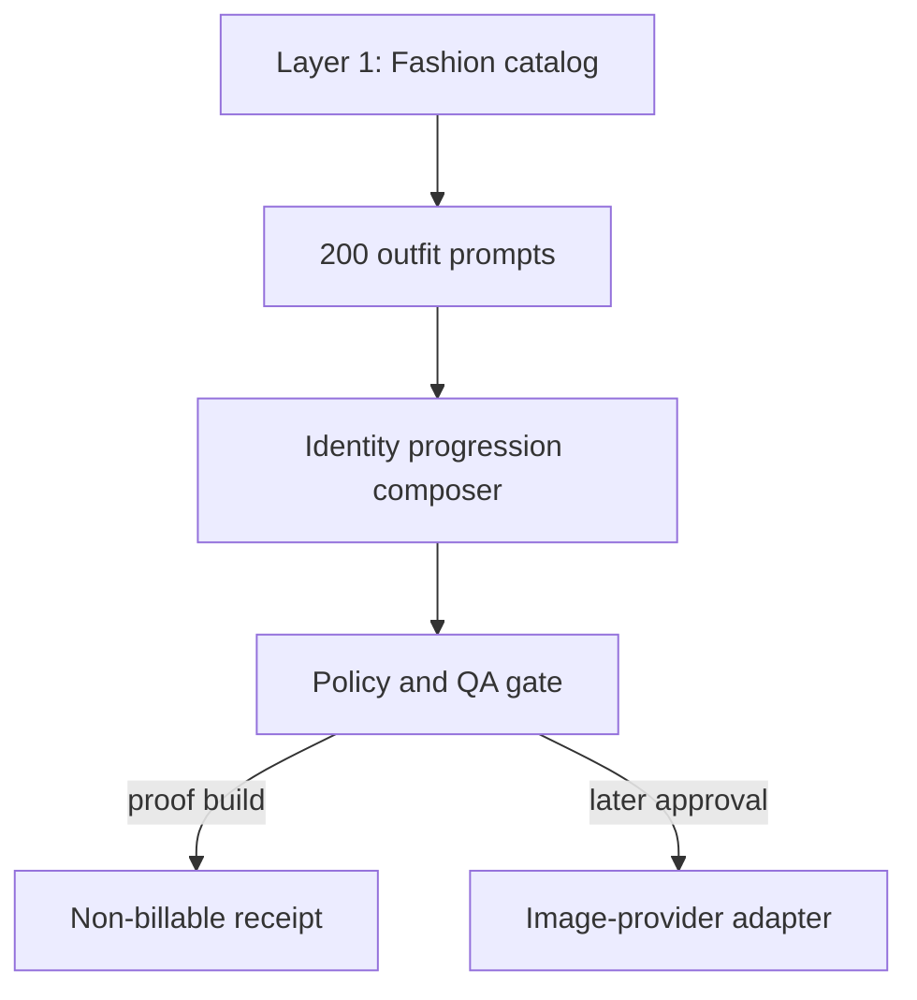

# Fashion Identity Ecosystem — MVP Architecture

Work item: `FIE-001`  
Version: `0.1.0`  
Decision owner: Human Authority (Blaize)

## Product boundary

This is a separate product with two layers and a hard proof gate between them.

Layer 1 is the authoritative catalog for clothing, footwear, accessories, jewelry, complete looks, visual descriptors, provenance, and prompt-ready metadata. Layer 2 selects one cataloged outfit prompt and one identity-progression level, compiles a deterministic generation contract, validates it, and creates an auditable job.

The MVP deliberately stops before a live image provider. This prevents accidental spending and makes prompt composition, identity protection, and catalog quality independently testable.

## Canonical identity rules enforced in code

- Same real adult subject; no recasting, blending, demographic drift, or substitution.
- No aging or age progression.
- Terminal ear jewelry goal is exactly 5 inches, using tunnels or filled plugs.
- North Star hair is short, dense, black 360 waves with no required blonde or red detailing.
- Existing tattoo designs and placements persist as coverage expands.
- Monumental, legible `RARE ONE` back composition at the North Star stage.
- Narrow sculpted beard, very thin mustache, eyebrow slit, rectangular black glasses, nose piercing, and signature chain/pendant.
- Every generated deliverable must be one standalone portrait image, never a multi-panel composition.

## Data model

| Entity | Purpose | MVP count |
| --- | --- | ---: |
| `products` | Garments, footwear, jewelry, and accessories | 15 seeded |
| `outfit_prompts` | DeepSeek outfit set 053–252 | 200 |
| `progression_levels` | Baseline through North Star | 6 |
| `generation_jobs` | Compiled prompts and proof receipts | Runtime |

SQLite provides a zero-configuration local proof database. The service boundary is intentionally portable to PostgreSQL when multi-user hosting is justified.

## API boundary

- `GET/POST /api/products`
- `GET /api/outfit-prompts`
- `GET /api/progression-levels`
- `POST /api/compose`
- `GET/POST /api/generation-jobs`
- `POST /api/generation-jobs/:id/run`

Only the `mock` provider is accepted. Its run action produces a prompt-proof receipt and explicitly does not create an image.

## Proof gates

1. Catalog: schema, search, provenance, and create/read behavior pass.
2. Prompt inventory: exactly 200 prompts cover every outfit ID from 053 through 252 once.
3. Identity contract: 5-inch goal, black 360 waves, no aging, identity lock, and standalone output pass automated tests.
4. Visual fidelity: a controlled sample across all six progression levels must preserve identity and outfit before batch generation is enabled.
5. Production: provider credentials, cost ceiling, retry/idempotency, private reference storage, deletion workflow, and human approval remain future gates.

## Expansion sequence

After visual proof, add a provider-neutral adapter interface, identity-reference vault, automated similarity and anatomy checks, private object storage, retry-safe workers, cost controls, and batch scheduling. Only then should recommendation, virtual try-on, shopping, collaboration, analytics, or other DeepSeek ecosystem layers be considered.
