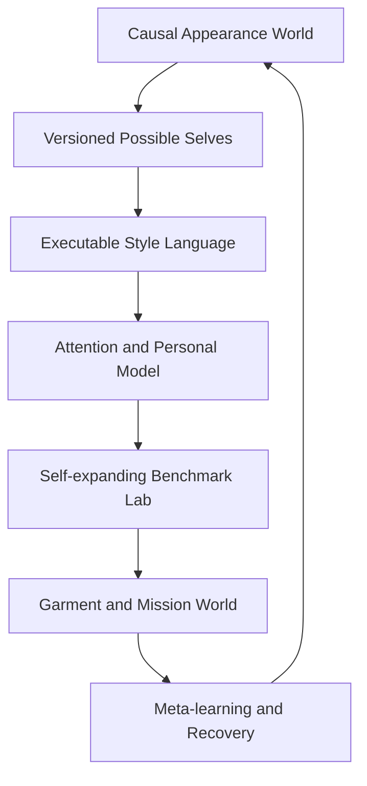

# Fully Autonomous Advanced Appearance Primitives

Status: Draft addendum for written review  
Date: 2026-08-29  
Target branch: `iteration/fully-autonomous`  
Parent portfolio: [Fully Autonomous Expansion Portfolio](./2026-08-29-autonomous-expansion-portfolio.md)  
Work item: `FIE-FA-PRIM-001`

## Scope and source boundary

This specification converts the second advanced discovery pass into autonomous branch-local primitives 51–99. The supplied source terminates during Feature 99, `Regret Predictor`; no Feature 100 or regret threshold was supplied, and this design does not fabricate one.

The primitives extend the closed internal learning loop. They do not weaken the [Dual-Iteration Separation Contract](./2026-08-29-dual-iteration-separation-contract.md), grant external action authority, or allow learned style branches to rewrite the immutable identity canon.

## Autonomous primitive loops

Autonomous capability families are:

- `Q1` — causal world modeling, counterfactual state transitions, diagnosis, and minimal repair;
- `Q2` — sandbox identity evolution, semantic style operations, constraints, grammars, and motifs;
- `Q3` — attention, distinctiveness, private personalization, synthetic curricula, and benchmark evolution; and
- `Q4` — garment behavior, comfort, temporal missions, resilience, digital supply chain, demand, timing, and regret.

## Causal world contract

The Personal Appearance World Model is an event-sourced belief system over the Digital Twin, wardrobe, grooming, context, environment, social setting, goal, presentation, action, and outcome. It estimates a distribution rather than one certain next state:

\[
p(S_{t+1} \mid S_t, do(A_t), C_t, M_v)
\]

where (M_v) is the active transition-model ensemble. Observations, interventions, predictions, counterfactuals, and synthetic samples remain distinct event types.

The autonomous repair policy searches for the highest expected utility per intervention burden:

\[
\Delta A^* = \arg\max_{\Delta A \in \mathcal F}
\frac{\mathbb E[U(S_t, A_t + \Delta A, C_t)] - \mathbb E[U(S_t,A_t,C_t)]}
{1 + B(\Delta A)}
\]

The feasible set (ℑ) is constitutionally projected before optimization. No reward, uncertainty, or predicted upside can make an identity, rights, authority, privacy, or output-contract violation eligible.

## Primitives 51–99

| # | Primitive | Autonomous specialization | Family |
| ---: | --- | --- | --- |
| 51 | Personal Appearance World Model | Continuously reconcile authorized Twin, wardrobe, grooming, context, environment, social, goal, presentation, action, and outcome events into temporal beliefs | Q1 |
| 52 | Appearance Causal Graph | Learn and challenge directed proportion, hierarchy, silhouette, footwear-mass, layer, focal-point, comfort, and context hypotheses with confidence and counterevidence | Q1 |
| 53 | Causal Style Experiments | Self-author interventions, controls, cohorts, stopping rules, and outcome collection; internally promote only after constitutional replay and causal evidence checks | Q1 |
| 54 | Personal Appearance Simulator | Route among calibrated transition models to predict distributions for visual, proportional, contextual, comfort, identity, and attention outcomes before rendering | Q1 |
| 55 | Style Search Over Possible Selves | Search a constrained tree of future style policies, wardrobe implications, grooming presentation, and signatures while preserving the real identity and canon | Q2 |
| 56 | Identity Branching | Autonomously fork, name, evaluate, prune, and archive experimental style-policy branches; none can become a new canonical person or physical history | Q2 |
| 57 | Identity Merge | Synthesize compatible experimental branches into a new sandbox branch and compute the smallest wardrobe and policy delta; Canon adoption remains Human Authority | Q2 |
| 58 | Style Version Control | Automatically commit every promoted internal style policy, preserve ancestry and semantic diffs, tag stable checkpoints, and recover prior behavior | Q2 |
| 59 | Appearance Diff Engine | Produce machine- and human-readable causal diffs across garments, silhouette, palette, material, hierarchy, context, attention, uncertainty, and predicted outcomes | Q2 |
| 60 | Outfit Debugger | Diagnose authorized photos or compiled looks through independent fit, palette, material, identity, proportion, footwear, hierarchy, context, weather, and comfort critics | Q1 |
| 61 | Minimal Intervention Optimizer | Learn intervention burden and outcome lift and choose the smallest constitutionally eligible repair that crosses the selected frontier | Q1 |
| 62 | Outfit Repair Agent | Autonomously generate, simulate, evaluate, and internally rank repaired copies by fit, color, proportion, context, price, weather, duration, and identity retention | Q1 |
| 63 | Make It Mine Engine | Abstract authorized inspiration and causally translate it through personal state, owned inventory, signatures, novelty frontier, and rights constraints | Q2 |
| 64 | Style Translation Engine | Learn reversible transformations among aesthetics, personas, seasons, formality, budget, environment, and progression contexts while preserving declared invariants | Q2 |
| 65 | Outfit Semantic Algebra | Plan and execute typed add, subtract, substitute, blend, scale, winterize, simplify, formalize, de-brand, and constraint operations with proof-carrying lineage | Q2 |
| 66 | Fashion Constraint Solver | Combine deterministic constraint programming with learned candidate generation; the solver proves feasibility before the model ranks or renders | Q1 |
| 67 | Constraint Relaxation Engine | Learn user-specific relaxation cost for soft constraints and generate Pareto-ranked alternatives; constitutional constraints remain outside the relaxation language | Q1 |
| 68 | Style Autocomplete | Predict context-aware next components and update probabilities from accepted, rejected, substituted, and actually worn outcomes while preserving exploration | Q2 |
| 69 | Visual Grammar Engine | Induce, version, test, and evolve persona- and context-specific outfit grammars and use them as low-cost generation policies | Q2 |
| 70 | Style Motif Mining | Mine recurrent accepted structures, detect subgroup failures, promote robust motifs as internal beliefs, and retire motifs under drift | Q2 |
| 71 | Visual Attention Model | Learn calibrated focal-point ordering from visual evidence and critic ensembles and compare attention flow with the intended presentation goal | Q3 |
| 72 | Attention Budget | Dynamically allocate finite visual complexity across body art, gauges, chain, eyewear, footwear, garments, accessories, pose, scene, and light | Q3 |
| 73 | Identity Anchor Budget | Constitutionally require minimum recognizable anchors by context and model visibility, occlusion, and substitution without weakening mandatory anchors | Q3 |
| 74 | Distinctiveness Optimizer | Learn a user-specific recognition function distinct from generic aesthetic quality and optimize it with privacy and anti-bias checks | Q3 |
| 75 | Anti-Generic Detector | Detect aesthetically strong but identity-weak looks, identify missing personal structure, and generate minimal signature repairs | Q3 |
| 76 | Style Overfitting Detector | Monitor diversity collapse, product dependence, motif saturation, critic gaming, and reward shortcuts and trigger bounded adjacent exploration | Q3 |
| 77 | Novelty Frontier | Maintain a contextual safe-to-adjacent-to-experimental boundary, allocate exploration near it, and quarantine identity-breaking regions | Q3 |
| 78 | Personal Fashion Foundation Model | Train or adapt a private lightweight personal model from authorized evidence inside fixed compute, privacy, evaluation, and rollback envelopes | Q3 |
| 79 | Federated Style Learning | Support only explicit opt-in, privacy-tested aggregate learning; the local constitutional layer validates every inbound and outbound update | Q3 |
| 80 | Synthetic Preference Lab | Continuously generate diverse synthetic briefs, Twins, garment states, budgets, weather, contexts, and failure cases to pretrain and stress competing policies | Q3 |
| 81 | Fashion Benchmark Suite | Maintain immutable constitutional and holdout tasks plus append-only discovered tasks for budget, feasibility, fit, weather, identity, reuse, repair, morphing, substitution, provenance, and causality | Q3 |
| 82 | Adversarial Outfit Testing | Operate a persistent red-team curriculum for hierarchy overload, collisions, identity drift, gauge anatomy, tattoos, prompt injection, critic collusion, and spurious causality | Q3 |
| 83 | Digital Twin Uncertainty Map | Propagate distributions, conflict, evidence age, and calibration through fit, comfort, appearance, commerce, and outcome forecasts | Q3 |
| 84 | Active Twin Calibration | Select the least burdensome authorized measurement, photo, comparison, or question with the highest expected reduction in decision-relevant uncertainty | Q3 |
| 85 | Garment Digital Twin | Reconcile dimensions, material, elasticity, weight, stiffness, geometry, drape, condition, and size claims into a temporal garment belief | Q4 |
| 86 | Garment Behavior Genome | Learn compact stretch, stiffness, drape, weight, compression, structure, and motion representations and recalibrate them from outcomes | Q4 |
| 87 | Layer Collision Engine | Predict and explain physical incompatibility across layer volumes, openings, ease, stiffness, closures, and Twin uncertainty before generation | Q4 |
| 88 | Motion Stress Simulator | Estimate standing, sitting, walking, reaching, driving, and bending failure distributions and target the most informative calibration evidence | Q4 |
| 89 | Outfit Comfort Model | Learn thermal, mobility, fabric, footwear, weight, compression, fatigue, and duration utility as a protected objective rather than a hidden style penalty | Q4 |
| 90 | Duration-Aware Styling | Model activity sequences, exposure, transitions, recovery, carried items, and comfort decay across the full intended duration | Q4 |
| 91 | Temporal Outfit Planning | Optimize multi-event look sequences and transformation paths under availability, care, packing, weather, comfort, camera, and identity constraints | Q4 |
| 92 | Appearance Mission Planner | Autonomously compile a high-level multi-day objective into strategy, packing, outfits, grooming logistics, contingencies, photography, research, and purchase-gap drafts | Q4 |
| 93 | Contingency Wardrobe | Generate, pre-evaluate, and maintain rain, cold, heat, formality, delay, damage, fit, and unavailable-item fallback branches | Q4 |
| 94 | Closet Resilience Score | Simulate item, category, weather, care, and travel disruptions and optimize high-value redundancy without uncontrolled accumulation | Q4 |
| 95 | Style Dependency Graph | Maintain causal and operational dependencies and distinguish identity-critical anchors, high-centrality utilities, substitutes, and overdependence | Q4 |
| 96 | Fashion Digital Supply Chain | Reconcile discovery, shortlist, source, price, approval, order, shipment, receipt, closet, wear, care, and resale events as one lifecycle belief graph | Q4 |
| 97 | Personal Demand Forecast | Learn calibrated category and timing demand from gaps, missions, seasons, progression, lifecycle, events, and policy uncertainty and open watch hypotheses | Q4 |
| 98 | Buy-Time Optimizer | Continually compare buy now, wait, watch, resale, substitute, and skip from market, inventory, deadline, leverage, regret, and uncertainty forecasts | Q4 |
| 99 | Regret Predictor | Learn and calibrate advisory regret probability from novelty, leverage, brand affinity, trend dependence, price, fit, future-state utility, return friction, and failure memory; no unsupported threshold is presumed | Q4 |

## Autonomous identity-version semantics

An experimental branch represents a possible style policy for the same real adult identity. The system can create and internally evaluate branches, merge them into new sandbox candidates, and auto-promote a branch for eligible internal recommendations when it remains inside the explicit target and constitutional envelope.

It cannot autonomously:

- replace or reinterpret the real identity;
- alter physical history or claim a simulated body change occurred;
- change the no-aging rule, exact 5-inch terminal gauge goal, tattoo canon, `RARE ONE` composition, mandatory jewelry, black 360 waves, or standalone-image contract;
- turn a grooming or wardrobe simulation into a real-world instruction or transaction; or
- merge a new North Star or constitutional identity target into Canon.

Every branch and merge retains parents, state delta, assumptions, anchor projection, policy genome, world-model version, predicted outcomes, counterevidence, evaluation curriculum, reward interval, and rollback checkpoint.

## Self-expanding benchmark governance

The benchmark has three strata:

1. **Constitutional suite** — immutable hard-rule and authority tests that the system cannot add to, remove, reweight, or replace;
2. **Protected holdout suite** — externally frozen evaluation cases used for promotion and drift detection; and
3. **Discovered curriculum** — append-only failures, rare cases, causal boundaries, and adversarial examples generated by the system.

The system may expand the third stratum and propose a new protected release. It cannot evaluate itself solely on tasks it generated, delete failures, move cases out of holdout, or lower a predeclared stopping rule.

## Branch-local event and belief primitives

- `appearance_world_events`, `appearance_state_beliefs`, `appearance_transition_ensembles`, and `appearance_outcome_events`;
- `causal_hypothesis_edges`, `causal_interventions`, `causal_estimates`, and `causal_refutations`;
- `possible_self_branches`, `style_policy_commits`, `sandbox_merge_events`, and `semantic_appearance_diffs`;
- `debugger_critic_events`, `repair_policy_runs`, `intervention_burden_models`, and `soft_constraint_frontiers`;
- `style_operation_programs`, `induced_grammar_policies`, `autocomplete_policies`, and `motif_beliefs`;
- `attention_model_versions`, `complexity_allocations`, `anchor_projections`, `distinctiveness_beliefs`, and `novelty_boundary_events`;
- `private_personal_models`, `federated_update_receipts`, `synthetic_world_curricula`, and `benchmark_strata`;
- `twin_uncertainty_beliefs`, `calibration_action_policies`, `garment_twin_beliefs`, and `behavior_genome_versions`;
- `collision_prediction_events`, `motion_stress_beliefs`, `comfort_reward_models`, and `duration_worlds`;
- `temporal_plan_policies`, `appearance_mission_cycles`, `contingency_branches`, and `resilience_simulations`; and
- `dependency_beliefs`, `supply_chain_events`, `demand_model_versions`, `buy_time_policies`, and `regret_model_versions`.

No primitive reads bounded tables, decisions, threshold configurations, evaluation cases, or learning state.

## Recursive proof cycle

1. Establish event truth types, the Appearance World Model, causal-graph hypotheses, and transition-model calibration.
2. Add autonomous constraint solving, diagnosis, repair, and minimal intervention with immutable hard constraints.
3. Add possible-self branches, semantic algebra, induced grammars, motifs, attention, anchors, distinctiveness, and novelty regulation.
4. Establish benchmark strata, persistent adversarial generation, uncertainty propagation, and active calibration.
5. Add the private personal-model lane only after privacy, compute, rollback, and evaluator independence are proven.
6. Add physics-lite Garment Twin, behavior, collision, motion, comfort, and duration models with continuous calibration.
7. Add mission, contingency, resilience, dependency, supply-chain, demand, timing, and regret loops.
8. Require the meta-controller to discover a seeded causal error, repair it, prove improvement on protected holdout, promote internally, and recover from a seeded regression.

## Acceptance criteria

This addendum is ready for implementation planning when:

1. all supplied primitives 51–99 have an autonomous branch-local disposition;
2. observations, predictions, interventions, counterfactuals, and synthetic cases cannot be conflated;
3. the constitutional projection precedes every search, solver, repair, branch, and promotion action;
4. the system can evolve discovered curricula but cannot edit constitutional or active protected tests;
5. personal-model and federated paths are private, opt-in where applicable, reversible, and non-authority-expanding;
6. physics-lite models remain uncertainty-aware and do not claim full cloth simulation;
7. external transactions, communications, publishing, deployment, and Canon changes remain Human Authority; and
8. branch-isolation tests reject bounded schemas, promotion queues, threshold receipts, and state.
