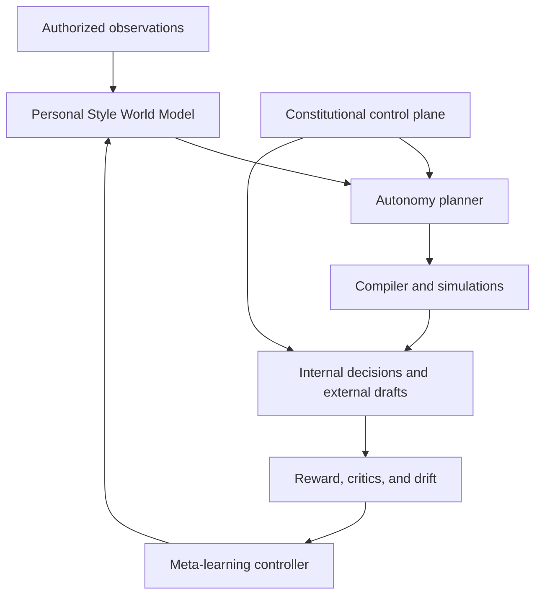

# Fully Autonomous Expansion Portfolio

Status: Draft addendum for written review  
Date: 2026-08-29  
Target branch: `iteration/fully-autonomous`  
Parent specification: [Fully Autonomous Fashion Intelligence Ecosystem](./2026-08-29-fully-autonomous-design.md)  
Work item: `FIE-FA-EXP-001`

Advanced primitives: [Fully Autonomous Advanced Appearance Primitives](./2026-08-29-autonomous-advanced-primitives.md)

## Strategic thesis

The fully autonomous iteration expands Sovereign Closet into a recursive Personal Identity OS whose internal agents continuously update a personal style world model, identify opportunities, simulate possible futures, evolve composition and learning policies, prepare high-quality actions, evaluate outcomes, recover from failures, and begin the next cycle.

The system is autonomous inside the learning and decision-support envelope. Human Authority remains supervisor and intervener and retains checkout, offers, seller or public communication, publication, identity-data disclosure, external-agent activation, deployment, credentials, spending, and authority expansion.

This portfolio is implemented independently from the bounded expansion. It does not share schemas, code packages, agents, weights, prompts, experiments, evaluations, or state.

## Recursive product stack

The six expansion programs, in priority order, are:

1. **Autonomous Wardrobe Capital** — continuous valuation, lifecycle, liquidity, insurance, and acquisition-impact intelligence;
2. **Agentic Commerce Simulation** — persistent objectives, search, price and market monitoring, negotiation planning, and gated execution drafts;
3. **Product Identity World Model** — passports, authenticity beliefs, provenance, care, ownership, and rights;
4. **Spatial Presence Runtime** — spatial closet, Mirror Mode, movement, live try-on, and in-store copilot;
5. **Creator and Brand Autopilot** — content generation, scheduling, visual-governance feedback, lookbooks, and shoot direction; and
6. **Private Identity Infrastructure** — scoped APIs, derived preference tokens, constitutional permissions, and approved specialist-agent routing.

Life context, emotional memory, and future-self simulation feed every program as first-class world-model state.

## Fifty-feature autonomous disposition

Horizon labels are unique to this branch: `A1` establishes the first paid autonomous asset product, `A2` adds commerce research and execution drafts, `A3` adds the ambient identity runtime, `A4` adds spatial and creator loops, and `A5` exposes private platform infrastructure.

| # | Capability | Autonomous implementation | Horizon |
| ---: | --- | --- | --- |
| 1 | Agentic Commerce Layer | Maintain persistent appearance objectives, detect gaps, research approved markets, score candidates, monitor prices, and evolve a local basket; exact checkout remains gated | A2 |
| 2 | Price Negotiation / Offer Agent | Continuously estimate market value and opponent-independent opening, counter, and walk-away strategies; outbound messages and offers remain approval-gated | A2 |
| 3 | Personal Fashion CFO | Maintain probabilistic cost basis, value, depreciation, liquidity, cost per wear, wardrobe leverage, identity importance, replacement cost, and closet NAV and learn forecast calibration | A1 |
| 4 | Automated Resale / Closet Liquidity | Continuously detect low-utility or high-opportunity assets, optimize rebalancing scenarios, generate listing assets and terms, and monitor draft performance; publication and acceptance remain gated | A1 |
| 5 | Digital Product Passport | Autonomously reconcile identifiers, materials, origin, care, repair, certification, authenticity, ownership, and resale claims into temporal passport beliefs | A1 |
| 6 | Authenticity Intelligence | Route multimodal evidence through independent critics, seller-risk models, and provenance checks and update calibrated authenticity confidence without claiming unsupported certainty | A1 |
| 7 | Ownership Provenance Graph | Maintain a temporal custody graph with competing claims, source trust, and evidence lineage from manufacture through current possession | A1 |
| 8 | Insurance Vault | Detect stale valuations or missing evidence, refresh authorized estimates, and maintain export-ready insurance and claim packets | A1 |
| 9 | Spatial Closet | Generate navigable spatial representations of current, candidate, and future wardrobes and learn which spatial organizations improve discovery | A4 |
| 10 | Mirror Mode | Use an explicitly activated camera session to adapt outfit, substitution, progression, posture, pose, and lighting guidance in real time | A4 |
| 11 | Real-Time Outfit Overlay | Jointly evaluate candidate garments, complete outfit state, Digital Twin beliefs, context, and motion rather than producing isolated try-ons | A4 |
| 12 | Movement Twin | Learn consented gait, posture, garment-motion, trouser, footwear, jewelry, and bag dynamics with uncertainty and drift monitoring | A4 |
| 13 | Social Presence Simulator | Calibrate uncertain context-specific presentation-signal models from opted-in outcomes while preventing them from becoming claims about personal worth | A3 |
| 14 | Persona Runtime | Select or blend approved persona policies for Founder, Date, Travel, Creative, Formal, Night, Fitness, Camera, Relaxed, and Public Appearance contexts | A3 |
| 15 | Calendar-Aware Appearance Planning | Proactively optimize week-level appearance, laundry, repetition, travel, weather, photo overlap, and availability from authorized calendar context | A3 |
| 16 | Automatic Morning Brief | Generate and improve a private daily brief from events, weather, wardrobe state, travel, persona, and confidence signals | A3 |
| 17 | Laundry and Availability State | Infer and reconcile clean, dirty, cleaners, repair, packed, loaned, sold, missing, and reserved states and suppress unavailable recommendations | A1 |
| 18 | Smart Hanger / NFC Layer | Treat approved NFC, QR, and RFID signals as physical-world events that update wear, care, availability, and retrieval context | A3 |
| 19 | Wear Logging Without Manual Input | Fuse authorized scan, camera, receipt, photo, and manual signals into confidence-weighted wear beliefs and ask only when ambiguity matters | A1 |
| 20 | Compliment Intelligence | Learn separate private-preference and optional external-response models while preserving user-controlled weighting, privacy, and deletion | A3 |
| 21 | Creator Mode | Autonomously build multi-format draft packages from approved looks and evaluate visual, metadata, product, and brand consistency before any publication gate | A4 |
| 22 | Autonomous Content Calendar | Continuously plan non-repetitive content across garments, personas, scenes, poses, progression levels, and performance evidence; publishing remains gated | A4 |
| 23 | Personal Brand Consistency Engine | Detect palette, signature, pose, recognition, composition, and lane drift and feed corrective hypotheses into the creator curriculum | A4 |
| 24 | Automated Lookbook Publisher | Maintain web, PDF, deck, catalog, and channel-specific draft builds and learn packaging quality; public release remains gated | A4 |
| 25 | Identity API | Maintain revocable, purpose-bound read projections of authorized style, size, palette, silhouette, and commerce rules; every recipient grant remains external authority | A5 |
| 26 | Privacy-Preserving Preference Token | Generate minimal, expiring derived vectors and measure recommendation utility without disclosing raw Twin, body, wardrobe, or history data | A5 |
| 27 | Agent Permission Ledger | Enforce a non-learnable, append-only permission constitution for search, watch, basket, offer, purchase, sale, publish, data, compute, and spend | A1 |
| 28 | Fashion Agent Marketplace | Benchmark and route among already approved specialist agents by domain, evidence, reliability, latency, and cost; installation and new access remain gated | A5 |
| 29 | Expert vs AI Debate Mode | Orchestrate Style, Value, Trend, Fit, Provenance, Risk, and dissent agents and learn which disagreements predict outcomes | A2 |
| 30 | Fashion Research Agent | Continuously operate a detected, researched, classified, tested, accepted, rejected, and revisited exploration queue | A2 |
| 31 | Designer Discovery Engine | Discover latent design-language matches outside familiar brands and measure whether exploration produces lasting affinity | A2 |
| 32 | Emerging Aesthetic Detection | Detect weak early clusters in authorized runway, product, creator, and market signals, assign provisional concepts, and track maturation or decay | A2 |
| 33 | Personal Trend Immunity | Decompose recommendation utility into stable personal affinity, social trend lift, scarcity, and novelty and regulate hype exposure | A2 |
| 34 | Trend Half-Life | Learn calibrated popularity, velocity, peak, decline, and longevity distributions and classify timeless, durable, seasonal, or spike behavior | A2 |
| 35 | Weather Resilience Score | Learn the interaction between aesthetic utility and actual temperature, wind, rain, snow, humidity, UV, terrain, exposure, and observed comfort | A3 |
| 36 | Thermal Outfit Model | Optimize base, mid, and outer layers from materials, insulation, wind, precipitation, activity, comfort feedback, and visual constraints | A3 |
| 37 | Fragrance Layer | Learn user-defined scent-profile relationships to persona, appearance, occasion, weather, and time without health or chemistry claims | A3 |
| 38 | Grooming Scheduler | Proactively schedule non-medical presentation logistics for hair, beard, brows, skin appearance, tattoo appearance, and wardrobe around events | A3 |
| 39 | Photo Shoot Director | Co-optimize scene, camera, lens, light, pose, crop, motion, and detail coverage and adapt optional live cues from visual feedback | A4 |
| 40 | Physical Store Copilot | Convert an authorized scan into fit, graph leverage, duplicate risk, market price, resale, unlocked outfits, progression value, and a reasoned Buy / Maybe / Skip position | A2 |
| 41 | Receipt-to-Closet | Continuously parse authorized receipts or emails, resolve catalog entities, create owned-item beliefs, and request only material missing evidence | A1 |
| 42 | Closet OCR / Bulk Scan | Reconstruct draft inventory from consented room, rack, wall, or drawer scans and improve entity resolution from corrections | A1 |
| 43 | Closet Reconstruction from Photos | Infer likely ownership, combinations, colors, silhouettes, and wear frequency from authorized historical images with temporal uncertainty | A1 |
| 44 | Relationship / Group Styling | Build temporary consented multi-person world models and optimize complementary looks without merging identities or preference data | A4 |
| 45 | Group Visual Harmony | Jointly optimize palette, formality, statement allocation, silhouette, and role while retaining participant-level constraints and explanations | A4 |
| 46 | Gift Intelligence | Generate useful gift candidates through an explicitly permitted, minimum-data view of gaps, sizing, duplicates, wishlist, price, and availability | A2 |
| 47 | Never Buy This Again | Turn return, fit, material, sizing, low-use, regret, and service failures into durable, explainable negative memory and test for changed circumstances | A1 |
| 48 | Clothing Memory | Preserve private people, place, event, image, and milestone associations separately from economic optimization and honor non-optimization locks | A3 |
| 49 | Timeline Playback | Reconstruct the evidence-supported world model, wardrobe, vectors, looks, purchases, photos, and progression beliefs at any supported event offset | A3 |
| 50 | Future-Self Simulator | Generate competing Minimal Luxury, Dark Avant-Garde, Rap Luxury, Founder, Hybrid, and newly discovered trajectories with assumptions, uncertainty, and reversibility | A3 |

## Thirty-layer recursive intelligence map

The 30 recursive layers are capabilities inside the five immediate modules. Their feedback is event-sourced, confidence-aware, and subordinate to the constitutional control plane.

| # | Recursive layer | Owning module | Autonomous specialization |
| ---: | --- | --- | --- |
| 1 | Personal Style World Model | Wardrobe Graph / Gap Analyzer | Maintain temporal beliefs across identity, wardrobe, context, behavior, and market and treat recommendations as simulated state transitions |
| 2 | Historical Style State Vector | Experiment / Meta-Learning Controller | Learn contextual aesthetic vectors, detect change points and drift, preserve full history, and distinguish observation from generated suggestion |
| 3 | Identity Delta Engine | Wardrobe Graph + Style Compiler | Continuously compare current beliefs with explicit target states, create gap hypotheses, and propose—never silently install—new targets |
| 4 | Outfit Counterfactual Engine | Outfit Counterfactual Engine | Generate causal single-factor and interaction worlds, estimate heterogeneous effects, and actively seek failure boundaries |
| 5 | Style Gradient Controls | Style Compiler | Map continuous semantic controls into constrained latent and Style IR transformations with reversible lineage |
| 6 | Style Compiler | Style Compiler | Evolve declarative compilation genomes from language and context to typed constraints, retrieval, optimization, prompt, and proof |
| 7 | Personal Uniform Discovery | Wardrobe Graph + Style Compiler | Discover stable recurring structures, promote internal uniform beliefs, and test controlled variants across context, season, and progression |
| 8 | Wardrobe Graph Compression | Wardrobe Graph / Gap Analyzer | Optimize expressive and contextual coverage against redundancy and classify core, specialist, novelty, bridge, and obsolete beliefs |
| 9 | Closet Entropy | Wardrobe Graph / Gap Analyzer | Learn a context-sensitive coherence/exploration target band and detect fragmentation or stagnation |
| 10 | Style Coverage Map | Wardrobe Graph / Gap Analyzer | Maintain a dynamic latent map and allocate exploration toward valuable adjacent or missing territory |
| 11 | Context Simulator | Outfit Counterfactual Engine | Simulate looks across authorized life contexts and identify the smallest changes that move a look onto the desired frontier |
| 12 | Occasion Morphing | Style Compiler + Counterfactual Engine | Optimize day sequences and transition cost through garment, footwear, accessory, grooming, and presentation changes |
| 13 | Packing Intelligence | Wardrobe Graph + Style Compiler | Solve context and outfit coverage per packed item under size, weight, care, weather, repetition, risk, and availability constraints |
| 14 | Garment Lifecycle Intelligence | Purchase Impact Simulator | Maintain lifecycle beliefs from acquisition through wear, care, condition, value, resale, sentiment, and retirement and recalibrate forecasts |
| 15 | Purchase Simulation | Purchase Impact Simulator | Insert candidate beliefs into future wardrobe graphs, generate outcomes, estimate regret and liquidity, and learn forecast accuracy without transacting |
| 16 | Identity Signature Detector | Style Compiler | Discover emergent signatures while preserving explicit canonical anchors in the non-learnable plane |
| 17 | Signature Strength vs Novelty | Style Compiler + Meta-Learning Controller | Allocate context-sensitive novelty through a constrained bandit and learn the user's durable recognizability frontier |
| 18 | Camera-Aware Styling | Style Compiler | Learn view, pose, crop, light, flash, seated, walking, and video performance from authorized visual evidence |
| 19 | Scene and Outfit Co-Optimization | Style Compiler + Counterfactual Engine | Jointly optimize outfit, environment, light, pose, camera, motion, and output contract as one causal design problem |
| 20 | Pose Intelligence | Style Compiler | Select and evaluate pose policies against garment geometry, anatomy, footwear, accessories, identity fidelity, and camera objective |
| 21 | Confidence-Adaptive Styling | Meta-Learning Controller | Learn acceptance probability inside an explicit user comfort envelope and allocate measured adjacent-stretch experiments |
| 22 | Identity Progression Curriculum | Meta-Learning Controller | Autonomously schedule current baseline, adjacent stretch, adoption evidence, and next challenge without aging or fabricated physical-state claims |
| 23 | Autonomous Style Experiments | Experiment / Meta-Learning Controller | Generate controls and variants, select cohorts, run replay and holdout tests, and internally promote passing policy challengers |
| 24 | Multi-Objective Optimization | Style Compiler + Counterfactual Engine | Learn contextual objective weights while retaining separable appearance, value, distinction, comfort, versatility, longevity, trend, recognition, and reuse scores |
| 25 | Style Pareto Frontier | Counterfactual Engine + Purchase Simulator | Maintain uncertainty-aware non-dominated sets and learn which frontier regions create lasting value rather than immediate clicks |
| 26 | Autonomous Gap Discovery | Wardrobe Graph / Gap Analyzer | Continuously diagnose weak connectivity, missing bridge nodes, context gaps, and emerging opportunities and open research hypotheses |
| 27 | Product Substitution Engine | Wardrobe Graph + Style Compiler | Generate exact, visual, budget, fit, quality, owned, available, lower-risk, and future-proof substitutes and learn outcome equivalence |
| 28 | Style Provenance | All five modules | Preserve causal lineage through source, seed, mutation, compiler, graph, Twin, critic, model, allocation, policy, and constitutional versions |
| 29 | Why Me? Explainability | Style Compiler | Generate evidence-grounded personalized explanations, test their faithfulness, and disclose uncertainty and counterevidence |
| 30 | Recursive Meta-Learning | Experiment / Meta-Learning Controller | Evolve how hypotheses, curricula, critics, exploration, routing, stopping rules, and reward decomposition improve—within fixed constitutional constraints |

Generated assets, simulations, and model predictions cannot create historical truth. Ownership, wear, transactions, physical change, social response, and private preference require authorized observations or explicit user assertions.

## Branch-local data domains

This branch owns an independent event and belief model. Representative aggregates are:

- `personal_world_events`, `personal_world_beliefs`, `style_vector_series`, `style_change_points`, and `identity_delta_hypotheses`;
- `wardrobe_belief_nodes`, `wardrobe_belief_edges`, `coverage_manifolds`, `entropy_models`, and `uniform_beliefs`;
- `asset_beliefs`, `valuation_model_versions`, `liquidity_hypotheses`, `lifecycle_beliefs`, and `insurance_packet_builds`;
- `passport_beliefs`, `identifier_claims`, `authenticity_critic_events`, `custody_beliefs`, and `rights_constraints`;
- `commerce_goals`, `market_observations`, `basket_hypotheses`, `negotiation_policy_runs`, and `external_action_drafts`;
- `availability_beliefs`, `wear_inference_events`, `physical_tag_events`, and `receipt_reconciliation_runs`;
- `persona_policies`, `ambient_context_events`, `appearance_plan_cycles`, `thermal_models`, and `confidence_curricula`;
- `creator_policy_genomes`, `content_plan_cycles`, `brand_drift_signals`, and `lookbook_builds`;
- `spatial_worlds`, `mirror_runtime_events`, `movement_beliefs`, and `photo_direction_policies`;
- `identity_projection_policies`, `private_preference_tokens`, `agent_benchmark_runs`, and `constitutional_permission_events`;
- `counterfactual_worlds`, `pareto_frontiers`, `substitution_beliefs`, `causal_style_receipts`, and `explanation_faithfulness_runs`; and
- `memory_beliefs`, `timeline_reconstructions`, and `future_self_worldlines`.

No table, event stream, checkpoint, model state, or learned vector is imported from or exported to the bounded branch.

## Constitutional consequence boundary

| Operation | Autonomous internal behavior | External boundary |
| --- | --- | --- |
| Discover, research, monitor, simulate, score, and learn | Continuous inside authorized connector, privacy, cost, and compute envelopes | No additional approval while envelope remains valid |
| Build a local basket, offer strategy, resale draft, content package, or API projection | Automatic with full receipts | Remains internal and non-representational |
| Modify a retailer-side cart or marketplace draft | Disabled unless the connector grant explicitly permits the exact reversible action | Human Authority grant required |
| Send an offer, counteroffer, seller message, gift disclosure, or public communication | Never self-authorized | Human Authority at exact recipient, scope, and terms |
| Checkout, bid, reserve, buy, sell, or accept | Never self-authorized | Human Authority at exact price, quantity, counterparty, and total |
| Publish content, listing, lookbook, or campaign | Never self-authorized | Human Authority per artifact set and destination |
| Expose an Identity API projection or preference token | Generate privately, deny sharing by default | Human Authority defines recipient, fields, purpose, and expiry |
| Activate a new external agent, model, connector, credential, or tool | Benchmark in isolation only when already allowed | Human Authority before runtime access |
| Increase authority, spend, retention, or data scope | Constitutionally ineligible | Human Authority through an explicit policy change |

The system may recommend a policy change but cannot treat its own recommendation as authorization. Human interventions are immutable external events and take precedence over learned policies.

## First revenue release gate

`A1` must ship a paid Autonomous Wardrobe Intelligence entitlement before later horizons count as release-complete. The product combines:

- continuously refreshed closet NAV and valuation confidence;
- lifecycle, cost-per-wear, and wardrobe-leverage intelligence;
- autonomous purchase-impact and avoided-regret simulations;
- resale and rebalancing opportunity discovery;
- product-passport, authenticity-screening, provenance, and insurance-vault views;
- proactive private anomaly and opportunity briefs; and
- premium future-wardrobe and private lookbook simulations from the five-module package.

Release requires an approved offer and price, entitlement enforcement, billing and cancellation receipts, privacy and deletion controls, explainable forecast uncertainty, affiliate disclosure when applicable, and measurement of activation, paid conversion, retention, realized recovered value, avoided low-impact purchases, and autonomous insight usefulness. It does not require autonomous checkout, publishing, or resale execution.

## External dependency validation

Commerce protocols, digital-passport standards, spatial-computing capabilities, virtual-try-on models, marketplace APIs, valuation feeds, weather, calendar, receipts, and creator platforms named in discovery are candidate adapters—not assumed facts or locked dependencies.

Before an implementation plan selects one, official current sources must verify availability, schema, test environment, terms, pricing, privacy, data use, geographic scope, rate limits, deprecation, and authority implications. Provider evidence is stored separately from the branch's constitutional contracts and world-model semantics.

## Portfolio acceptance criteria

The autonomous expansion portfolio is ready for implementation planning when:

1. all 50 adjacent capabilities and all 30 recursive layers have an autonomous branch-local disposition;
2. the five immediate modules form the first complete learning substrate;
3. `A1` has a testable paid entitlement and outcome metric;
4. every external side effect is constitutionally separated from internal autonomy;
5. observations, beliefs, simulations, targets, and immutable facts are distinguishable and reconstructable;
6. no full 3D cloth-physics dependency blocks the first three horizons;
7. multiple nested loops can improve without sharing state with the bounded branch; and
8. branch-isolation tests reject bounded queues, gatekeeper state, fixed bounded thresholds, or copied learning artifacts.
