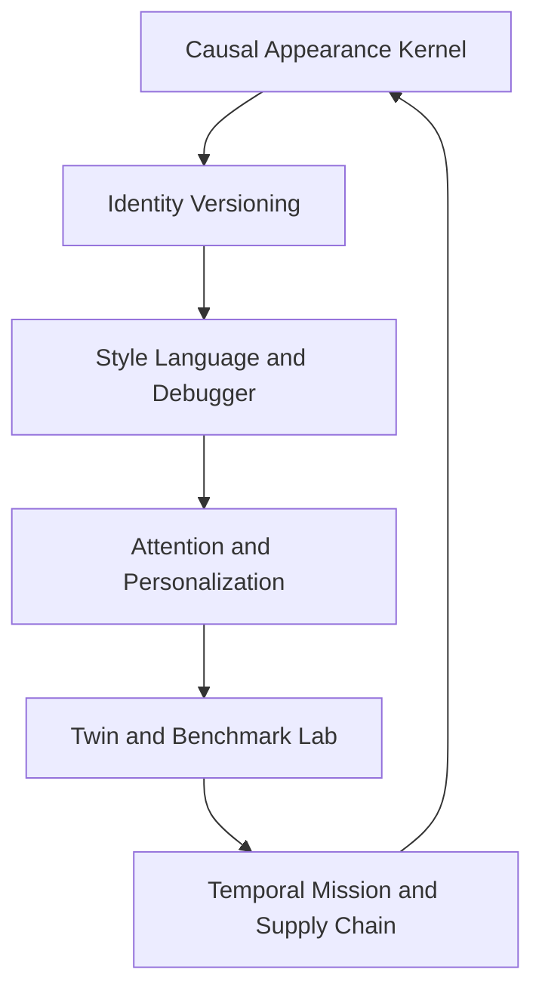

# Bounded Advanced Appearance Primitives

Status: Draft addendum for written review  
Date: 2026-08-29  
Target branch: `iteration/bounded-auto-promotion`  
Parent portfolio: [Bounded Auto-Promotion Expansion Portfolio](./2026-08-29-bounded-expansion-portfolio.md)  
Work item: `FIE-BA-PRIM-001`

## Scope and source boundary

This specification converts the second advanced discovery pass into branch-local primitives 51–99. The supplied source ends during Feature 99, `Regret Predictor`; no Feature 100 or numeric regret threshold was provided, so neither is invented here.

These primitives deepen the five immediate modules. They do not replace the [Dual-Iteration Separation Contract](./2026-08-29-dual-iteration-separation-contract.md), authorize full 3D cloth physics, or permit experimental identity branches to overwrite the immutable identity canon.

## Primitive families

Delivery families are:

- `P1` — Causal Appearance Kernel and minimal-intervention reasoning;
- `P2` — identity branches, version control, formal style language, grammar, and repair;
- `P3` — attention, identity distinctiveness, private personalization, and evaluation infrastructure; and
- `P4` — garment behavior, comfort, temporal missions, resilience, supply chain, and purchase timing.

## Appearance kernel contracts

The Personal Appearance World Model extends the Digital Twin without merging fact types. A state contains Twin snapshot, wardrobe state, grooming state, context, environment, social setting, appearance goal, presentation plan, and predicted outcomes.

The bounded simulator estimates:

\[
\hat S_{t+1} = F_v(S_t, A_t, C_t)
\]

where (F_v) is a versioned, testable model; observed outcomes remain separate from predictions. A causal edge is a hypothesis until a declared experiment or authoritative rule supports it.

The Minimal Intervention Optimizer solves:

\[
\min_{\Delta A} \operatorname{Cost}(\Delta A)
\quad \text{subject to} \quad
U(S_t, A_t + \Delta A, C_t) \ge U_{target}
\]

Change cost includes number of substitutions, physical effort, money, time, comfort, availability, and identity disruption. Hard canon and required constraints cannot be relaxed.

## Primitives 51–99

| # | Primitive | Bounded implementation | Family |
| ---: | --- | --- | --- |
| 51 | Personal Appearance World Model | Version Twin, wardrobe, grooming, context, environment, social setting, goal, current presentation, and predicted outcome as typed, evidence-linked state | P1 |
| 52 | Appearance Causal Graph | Store proportion, hierarchy, silhouette, footwear-mass, layer, and focal-point relations as rules or confidence-bearing hypotheses with supporting and contradicting evidence | P1 |
| 53 | Causal Style Experiments | Generate controlled single-intervention comparisons and queue them through replay, human evidence, shadow evaluation, and bounded promotion | P1 |
| 54 | Personal Appearance Simulator | Predict state deltas for visual weight, proportion, formality, intensity, tattoo visibility, comfort, and other declared dimensions before rendering | P1 |
| 55 | Style Search Over Possible Selves | Search sandbox identity branches that preserve the real identity and canon while varying style language, wardrobe implications, grooming presentation, and signatures | P2 |
| 56 | Identity Branching | Fork named experimental style states from a canonical checkpoint; branches are visibly synthetic and never overwrite Canon automatically | P2 |
| 57 | Identity Merge | Produce a reviewable synthesis and minimum-change plan from successful branches; canonical adoption requires explicit Human Authority | P2 |
| 58 | Style Version Control | Commit, compare, tag, restore, and audit style-state changes such as tailoring, branding, outerwear, and jewelry balance without rewriting physical history | P2 |
| 59 | Appearance Diff Engine | Generate structural and semantic diffs for products, silhouette, palette, materials, hierarchy, proportion, context, and predicted signal | P2 |
| 60 | Outfit Debugger | Compile a photographed or described look, identify failing constraints and low-confidence diagnoses, and rank the smallest likely fixes | P1 |
| 61 | Minimal Intervention Optimizer | Find the least costly garment, styling, availability, weather, or context change that reaches a declared target score | P1 |
| 62 | Outfit Repair Agent | Apply one approved repair mode to a copy of the look, preserve the original, and emit a causal diff and constraint receipt | P2 |
| 63 | Make It Mine Engine | Decompose authorized inspiration into abstract silhouette, palette, material, weight, layering, footwear, jewelry, and mood and recompile it through the user's identity system | P2 |
| 64 | Style Translation Engine | Translate between aesthetic, persona, season, formality, and budget languages while preserving declared Outfit DNA and identity anchors | P2 |
| 65 | Outfit Semantic Algebra | Support typed add, subtract, substitute, blend, scale, winterize, de-brand, and constrain operations with previews and reversible history | P2 |
| 66 | Fashion Constraint Solver | Solve required, forbidden, budget, formality, weather, availability, fit, rights, and identity constraints deterministically before generative refinement | P1 |
| 67 | Constraint Relaxation Engine | Return the smallest ranked relaxations when no feasible solution exists; hard canon, identity continuity, rights, and authority constraints never appear as relaxable | P1 |
| 68 | Style Autocomplete | Predict compatible next components with confidence, evidence, availability, and diversity controls as the user constructs a look | P2 |
| 69 | Visual Grammar Engine | Define persona-specific typed grammars for base, frame, lower, foot, signature, accent, and optional layers and generate valid structures without requiring an LLM | P2 |
| 70 | Style Motif Mining | Discover repeated structures in accepted evidence, report support and failure cohorts, and submit motifs to the bounded promotion pipeline | P2 |
| 71 | Visual Attention Model | Predict ordered focal points and confidence and compare them with the intended hierarchy | P3 |
| 72 | Attention Budget | Allocate finite visual complexity across tattoos, gauges, chain, footwear, garments, watch, scene, and other focal elements and flag overload | P3 |
| 73 | Identity Anchor Budget | Enforce context-specific minimum retention of explicit identity anchors and expose which anchors are present, occluded, or absent | P3 |
| 74 | Distinctiveness Optimizer | Score how specifically recognizable a look is as this user's style, separately from generic aesthetic quality | P3 |
| 75 | Anti-Generic Detector | Warn when a polished look lacks sufficient user-specific identity and propose the smallest signature injection | P3 |
| 76 | Style Overfitting Detector | Detect collapsing diversity, repeated templates, narrow product dependence, or critic gaming and queue adjacent exploration | P3 |
| 77 | Novelty Frontier | Classify known-safe, adjacent, experimental, and identity-breaking regions and allow operation only inside the configured frontier | P3 |
| 78 | Personal Fashion Foundation Model | Define a future private lightweight personalization adapter trained from authorized comparisons, wardrobe, photos, mutations, and outcomes; activation follows evaluation and promotion gates | P3 |
| 79 | Federated Style Learning | Reserve an opt-in architecture for privacy-preserving aggregate learning with no raw Twin or wardrobe export; participation and update acceptance are separately gated | P3 |
| 80 | Synthetic Preference Lab | Generate diverse synthetic briefs, geometries, contexts, weather, and budgets for pretraining and regression tests while labeling all preferences synthetic | P3 |
| 81 | Fashion Benchmark Suite | Score budget, feasibility, harmony, fit eligibility, weather, identity, reuse, intervention cost, morphing, substitution, provenance, and explanation fidelity for every candidate release | P3 |
| 82 | Adversarial Outfit Testing | Construct hierarchy, layering, accessory, tattoo, gauge, proportion, and prompt-injection stress cases and require recovery without deleting identity | P3 |
| 83 | Digital Twin Uncertainty Map | Store distributions, confidence, evidence age, and conflict for measurements and traits and propagate uncertainty into fit and simulation results | P3 |
| 84 | Active Twin Calibration | Rank the single authorized measurement or observation that would reduce consequential uncertainty most and ask only when expected value exceeds burden | P3 |
| 85 | Garment Digital Twin | Model dimensions, material, elasticity, weight, stiffness, geometry, drape, condition, and size as evidence-linked garment state | P4 |
| 86 | Garment Behavior Genome | Compress stretch, stiffness, drape, weight, compression, structure, and related behavior into a versioned comparable representation | P4 |
| 87 | Layer Collision Engine | Estimate physical incompatibility among layers and reject combinations such as high-bulk under low-ease garments before visualization | P4 |
| 88 | Motion Stress Simulator | Evaluate standing, sitting, walking, reaching, driving, and bending against garment and Twin uncertainty without claiming full physics | P4 |
| 89 | Outfit Comfort Model | Combine thermal, mobility, fabric, footwear, weight, compression, duration, and user feedback as a separate optimization objective | P4 |
| 90 | Duration-Aware Styling | Model the full activity and exposure duration rather than treating an occasion label as sufficient context | P4 |
| 91 | Temporal Outfit Planning | Optimize a sequence of looks and the minimum change path across commute, meeting, dinner, night, and other event states | P4 |
| 92 | Appearance Mission Planner | Compile a multi-day goal into strategy, packing, outfits, grooming logistics, weather contingencies, photography, and purchase gaps | P4 |
| 93 | Contingency Wardrobe | Generate rain, temperature, formality, damage, delay, and unavailable-item fallbacks for each approved plan | P4 |
| 94 | Closet Resilience Score | Measure how much high-utility coverage survives item loss, care, travel, or weather disruption and recommend bridge redundancy | P4 |
| 95 | Style Dependency Graph | Identify identity-critical, useful, substitutable, and overdependent single points of failure in products and signature objects | P4 |
| 96 | Fashion Digital Supply Chain | Track a desired product through discovery, shortlist, source, availability, price, approval, purchase, shipment, closet, wear, care, and resale state | P4 |
| 97 | Personal Demand Forecast | Forecast category demand from gaps, season, progression, missions, lifecycle, and event evidence and propose bounded watch targets | P4 |
| 98 | Buy-Time Optimizer | Compare buy now, wait, watch, resale, substitute, and skip using price history, season, inventory, use deadline, and uncertainty | P4 |
| 99 | Regret Predictor | Estimate advisory regret risk from novelty, leverage, brand affinity, trend dependence, price, fit uncertainty, future-state utility, return friction, and failure memory; no unsupported numeric threshold is assumed | P4 |

## Identity branch semantics

An identity branch is a style-policy sandbox, not a different person. It cannot alter facial identity, demographics, physical history, tattoo canon, exact 5-inch terminal gauge goal, mandatory signature chain and pendant, black 360-wave specification, or standalone-image contract.

The branch stores:

- parent identity-style checkpoint;
- declared hypothesis and intended delta;
- wardrobe and grooming-presentation implications;
- required and retained anchors;
- generated simulations and uncertainty;
- evaluation, acceptance, and actual-wear evidence; and
- a proposed merge diff.

Only Human Authority can merge a branch into the canonical target style. Rejected branches remain available as historical learning evidence without contaminating the active policy.

## Branch-local data primitives

- `appearance_world_snapshots`, `appearance_actions`, `appearance_predictions`, and `appearance_outcomes`;
- `causal_style_nodes`, `causal_style_edges`, `causal_experiments`, and `causal_confidence_updates`;
- `identity_style_branches`, `identity_style_commits`, `identity_merge_proposals`, and `appearance_diffs`;
- `outfit_debug_sessions`, `repair_candidates`, `intervention_costs`, and `constraint_relaxation_sets`;
- `style_algebra_expressions`, `visual_grammar_versions`, `autocomplete_events`, and `motif_candidates`;
- `attention_predictions`, `attention_budgets`, `anchor_budgets`, `distinctiveness_scores`, and `novelty_frontiers`;
- `personal_model_versions`, `synthetic_preference_cases`, `benchmark_versions`, and `adversarial_cases`;
- `twin_uncertainty_fields`, `calibration_questions`, `garment_twins`, and `garment_behavior_genomes`;
- `layer_collision_assessments`, `motion_stress_runs`, `comfort_observations`, and `duration_contexts`;
- `temporal_appearance_plans`, `appearance_missions`, `contingency_looks`, and `closet_resilience_snapshots`; and
- `style_dependencies`, `product_lifecycle_states`, `demand_forecasts`, `buy_time_assessments`, and `regret_assessments`.

## Proof sequence

1. Build the Personal Appearance World Model and fact/belief/prediction boundaries on top of branch-local event history.
2. Add formal constraints, Appearance Diff, Outfit Debugger, Minimal Intervention, and deterministic relaxation.
3. Add identity style branches, Style Algebra, Visual Grammar, motif mining, and attention/anchor budgets.
4. Establish the benchmark, adversarial suite, uncertainty propagation, and active calibration before training a personal model.
5. Add physics-lite Garment Twins, behavior genomes, collision, motion-stress, comfort, and duration models.
6. Add temporal missions, contingency, resilience, dependency, lifecycle, demand, timing, and regret decision support.

Each family advances through bounded replay, shadow, canary, and rollback. No primitive can promote itself by changing its own benchmark, constraints, evidence population, or stopping rule.

## Acceptance criteria

This addendum is ready for implementation planning when:

1. all supplied primitives 51–99 have an explicit bounded disposition;
2. predicted, synthetic, inferred, asserted, and observed state cannot be conflated;
3. hard constraints are absent from every relaxation candidate set;
4. identity branches cannot overwrite Canon without Human Authority;
5. the benchmark exercises causal, compiler, attention, uncertainty, garment, temporal, and supply-chain primitives;
6. physics-lite models expose uncertainty and never imply full cloth simulation; and
7. branch-isolation tests reject autonomous world events, learned policies, or checkpoints.
