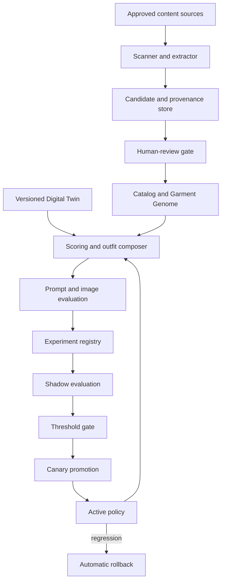
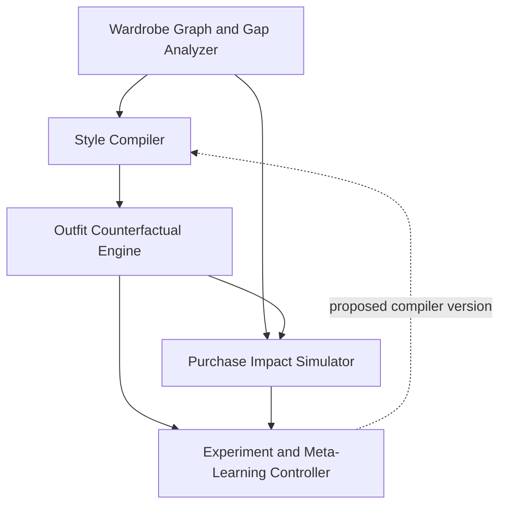

# Bounded Auto-Promotion Fashion Ecosystem

Status: Approved architecture specification  
Date: 2026-08-29  
Target branch: `iteration/bounded-auto-promotion`  
Work item: `FIE-BA-001`

Expansion addendum: [Bounded Auto-Promotion Expansion Portfolio](./2026-08-29-bounded-expansion-portfolio.md)

## Product outcome

Create a governance-first, recursively improving fashion intelligence system that expands its catalog, models a changing Digital Twin, composes outfits, evaluates generated results, and promotes successful internal changes automatically only after explicit evidence thresholds pass.

The beneficiary is the owner/operator who wants a high-fidelity personal fashion system without surrendering identity control, source provenance, cost visibility, or reversibility.

## Observable success

The first production-capable milestone succeeds when it can:

1. maintain a versioned Digital Twin and identity canon;
2. scan approved sources into reviewable catalog candidates;
3. score products and outfits with explainable component scores;
4. compose all 200 source outfits across six progression levels;
5. capture image and human feedback as evaluation evidence;
6. propose and test a scoring or prompt change in shadow mode;
7. promote a passing change through a bounded canary;
8. reject or roll back a regression automatically; and
9. produce a complete, readable promotion receipt.

## Non-goals for the first milestone

- public social network or community marketplace;
- live shopping transactions;
- automated public publishing;
- unbounded web crawling;
- autonomous provider spending outside a pre-approved envelope;
- physical garment manufacturing; or
- replacing professional medical, fitness, tattoo, or body-modification advice.

## Canon conformance

This specification inherits the [Dual-Iteration Separation Contract](./2026-08-29-dual-iteration-separation-contract.md). Every generated result must preserve the same real adult identity without demographic substitution or age progression; use a terminal gauge goal of exactly 5 inches with tunnels or filled plugs; retain the established tattoos, monumental legible `RARE ONE` back composition, narrow sculpted beard, very thin mustache, eyebrow slit, rectangular black glasses, small nose piercing, signature chain, and pendant; and remain one standalone image rather than a collage or multi-panel composition.

Hair is short, dense black 360 waves. Blonde or red hair detailing is not added unless Human Authority explicitly requests it for a specific output.

## System architecture

Every stage writes append-only evidence. Agents may propose and execute reversible internal experiments, but promotion is controlled by deterministic gates and branch-local policy.

## Immediate five-module implementation package

Supplemental DeepSeek thread material supplied by Human Authority on 2026-08-29 identifies five modules as the strongest next functional package. This branch implements them with fixed interfaces, explainable calculations, explicit evidence gates, and no dependency on full 3D cloth physics.

| Module | Bounded responsibility | Primary artifacts | Authority boundary |
| --- | --- | --- | --- |
| Style Compiler | Compile a Digital Twin snapshot, progression level, wardrobe graph, occasion, climate, and style policy into a typed Style IR, complete look, standalone-image prompt, and constraint report | Style IR, compiled look, prompt artifact, canon certificate, compiler receipt | Compiler versions enter shadow and canary; they do not activate themselves |
| Outfit Counterfactual Engine | Produce controlled variants that change one declared factor at a time and estimate the effect on utility, identity fidelity, fit, cost, and novelty | Counterfactual set, factor delta, score delta, uncertainty, comparison receipt | Only approved catalog facts and bounded variant dimensions; no hidden changes to identity or progression |
| Wardrobe Graph / Gap Analyzer | Model owned, available, desired, incompatible, substitutable, and missing items and identify the smallest high-value gaps | Wardrobe nodes and edges, coverage map, gap report, recommended search brief | Discovered candidates remain reviewable; the module cannot purchase or silently add owned items |
| Purchase Impact Simulator | Estimate the marginal effect of a candidate acquisition on outfit coverage, redundancy, cost per wear, progression utility, fit risk, and budget | Purchase scenario, before/after coverage, uncertainty range, recommendation rationale | Advisory only; it cannot transact, reserve, message a seller, or alter a budget |
| Experiment / Meta-Learning Controller | Select bounded experiment templates, schedule replay and shadow tests, compare evidence, and propose the next safest informative test | Experiment plan, cohort manifest, stopping rule, policy diff, promotion evidence | Fixed promotion thresholds and canary policy remain outside its learning authority |

The Style IR is a branch-local, versioned contract rather than free-form prompt text. At minimum it carries identity-canon version, Twin snapshot, progression level, garment and accessory references, silhouette, proportions, palette, materials, styling relations, pose, camera, environment, output contract, provenance, and unresolved uncertainty. Compilation fails closed when required fields or canon checks are missing.

Counterfactuals are paired against the same baseline and declare their intervention, such as footwear, outer layer, accessory density, palette balance, silhouette, occasion, or budget. A comparison is invalid if more than the declared factor changes without a recorded interaction test.

This package is accepted when one reviewed wardrobe gap can produce a compiled baseline, at least three valid counterfactuals, a purchase-impact comparison, and a meta-controller experiment proposal with a complete lineage receipt—without a live provider or transaction.

## Principal components

### Digital Twin Registry

Stores the current real-world baseline, progression targets, measurements, identity anchors, grooming, tattoos, gauges, fit preferences, accessibility preferences, and confidence for every attribute. Every update creates a snapshot; no mutation overwrites history.

Raw private identity images remain outside ordinary catalog storage. The registry stores controlled references, hashes, rights, purpose, and retention state.

### Garment Genome

Represents each product through normalized fields for category, silhouette, dimensions, material, drape, weight, color, pattern, season, occasion, brand, provenance, rarity, price state, compatibility, care, availability, rights, and generation descriptors.

### Content Scanner

Runs only against configured approved sources. It captures source snapshots, extracts product candidates, records retrieval time and rights status, rejects unsupported claims, and queues ambiguous candidates for review.

### Scoring Engine

Calculates a transparent scorecard rather than one opaque value. Every score includes component values, weights, confidence, evidence, and the active policy version.

### Outfit Composer

Combines retrieval, compatibility constraints, Digital Twin fit, progression level, occasion, climate, budget, and novelty into complete looks. It can reproduce source outfits or create new capsules without changing the 200 immutable source prompts.

### Evaluation Harness

Evaluates prompt validity, single-image compliance, identity fidelity, pose, gauge anatomy, tattoo continuity, outfit adherence, realism, style utility, latency, and cost. Human ratings remain the ground truth for subjective identity quality until an automated evaluator is separately validated.

### Promotion Controller

Owns proposed, shadow, canary, active, rejected, and rolled-back states. Only this component may activate a learned policy. It cannot waive hard identity rules.

## Twenty-five product features

1. Versioned Digital Twin profile
2. Measurement and physique timeline
3. Private identity-anchor registry
4. Identity-progression simulator
5. Garment Genome records
6. Approved-source content scanner
7. Structured metadata extraction
8. Duplicate and near-duplicate detection
9. Counterfeit and provenance-risk flags
10. Candidate-review inbox
11. Source and lineage inspector
12. Outfit compatibility score
13. Digital Twin alignment score
14. Fit-risk score
15. Trend relevance score
16. Novelty and recognizability score
17. Confidence calibration
18. Explainable score breakdowns
19. Capsule and complete-look builder
20. Human preference feedback capture
21. Visual-fidelity evaluation matrix
22. Shadow experiment runner
23. Canary promotion ladder
24. Policy-diff and promotion receipt viewer
25. Automatic regression rollback

Additional first-iteration commercial capabilities are affiliate-ready product metadata, exportable private lookbooks, licensable prompt packs, entitlement hooks, and a premium automation tier. Payments and public offers remain separately gated.

## Agent roles

| Agent | Mission | Promotion authority |
| --- | --- | --- |
| Source Scout | Monitor approved sources and propose scan targets | None |
| Extractor | Convert source snapshots into structured candidates | None |
| Provenance Steward | Verify lineage, rights, confidence, and conflicts | None |
| Twin Steward | Propose versioned Digital Twin updates | None |
| Stylist | Retrieve, rank, and compose outfits | None |
| Visual Critic | Score generation outputs against the evaluation rubric | None |
| Experiment Designer | Propose bounded variants and expected outcomes | None |
| Gatekeeper | Apply deterministic promotion policy | Threshold-bound only |
| Rollback Controller | Restore last verified active version | Automatic on hard regression |
| Audit Librarian | Preserve evidence, versions, and receipts | None |

## Data model additions

- `digital_twins`
- `twin_snapshots`
- `identity_anchor_refs`
- `content_sources`
- `scan_runs`
- `source_snapshots`
- `catalog_candidates`
- `candidate_conflicts`
- `provenance_edges`
- `garment_genomes`
- `score_policies`
- `scorecards`
- `outfit_compositions`
- `style_ir_versions`
- `compiled_style_artifacts`
- `wardrobe_graph_nodes`
- `wardrobe_graph_edges`
- `wardrobe_gap_assessments`
- `counterfactual_sets`
- `counterfactual_variants`
- `purchase_impact_scenarios`
- `meta_experiment_policies`
- `feedback_events`
- `evaluation_runs`
- `evaluation_dimensions`
- `experiments`
- `experiment_variants`
- `promotion_decisions`
- `canary_runs`
- `rollback_events`
- `cost_events`
- `audit_events`

All learning-related records carry branch, policy version, source version, timestamp, actor, evidence state, and correlation ID.

## Scoring model

The initial outfit utility score is a weighted composite:

\[
U = 0.25I + 0.18F + 0.16C + 0.12Q + 0.10P + 0.08T + 0.06N + 0.05V
\]

Where:

- \(I\): identity alignment
- \(F\): fit and proportion
- \(C\): cross-item compatibility
- \(Q\): source and catalog quality
- \(P\): prompt/image adherence
- \(T\): trend relevance
- \(N\): novelty
- \(V\): value and availability

The displayed composite never hides its components. Hard canon failures force the total to zero regardless of the weighted result.

## Promotion policy

A variant may enter canary only when:

- all hard identity and output-contract checks pass;
- catalog provenance confidence is at least `0.90` for promoted records;
- required metadata completeness is at least `0.85`;
- duplicate risk is below `0.15` or explicitly resolved;
- controlled visual acceptance is at least `85%`;
- identity and pose receive at least `4/5` on at least `90%` of the evaluated sample;
- standalone-image compliance is `100%`;
- P95 generation latency is below `45 seconds` when a live provider is enabled;
- mean billable generation cost is no more than `$0.10` when a live provider is enabled; and
- no primary metric degrades by more than one percentage point against the active baseline.

Canary exposure is ten percent of eligible internal jobs for at least 25 jobs or 24 hours, whichever is longer. A hard-rule failure, statistical regression beyond policy, unexplained cost breach, or evidence-integrity failure triggers immediate rollback.

## KPI framework

Primary KPIs:

1. accepted-look rate;
2. identity-faithful output rate; and
3. verified improvement promotion rate.

Drivers:

- candidate-to-approved catalog yield;
- Digital Twin alignment score;
- outfit reuse and save rate;
- evaluation coverage; and
- time from experiment proposal to verified decision.

Guardrails:

- hard-canon violation rate must remain zero;
- rollback recovery must complete within one evaluation cycle;
- unprovenance catalog exposure must remain zero; and
- cost and latency must remain inside the configured envelope.

## User experience

The product becomes a `Control Room` with five primary workspaces:

1. **Twin** — current state, progression snapshots, confidence, and protected references;
2. **Catalog Intelligence** — products, sources, candidates, conflicts, and provenance;
3. **Style Studio** — retrieval, composition, capsules, prompts, and visual proofs;
4. **Promotion Queue** — evidence, policy diffs, shadow results, canaries, approvals, and rollback;
5. **Scoreboard** — KPI trends, quality dimensions, cost, latency, and improvement velocity.

The interface retains black luxury styling with crimson and warm-metal accents. Risk and gate states are always represented with text and icons, not color alone.

## Error handling and recovery

- Scan failures preserve partial receipts and resume from the last idempotent checkpoint.
- Conflicting extractions create conflict records; agents do not silently choose.
- Low-confidence scores display uncertainty and cannot promote evidence.
- Provider failures retry within a bounded idempotency key and cost ceiling.
- Missing identity evidence blocks only the affected visual job.
- Promotion failures leave the active policy untouched.
- Rollback restores the last verified version and preserves the failed version for analysis.

## Testing strategy

- unit tests for scoring, policy transitions, normalization, deduplication, and canon rules;
- property tests for score bounds and deterministic promotion decisions;
- integration tests for scan-to-candidate, candidate-to-catalog, outfit-to-evaluation, and experiment-to-rollback flows;
- golden tests for the 200 source prompts across all progression levels;
- migration tests for every schema version;
- accessibility and responsive-interface checks;
- adversarial tests for prompt injection in scanned content; and
- branch-isolation tests that reject autonomous-only schemas or states.

## Initial milestone sequence

1. Expand the schema and repositories without enabling network scanners.
2. Implement the Digital Twin, Garment Genome, Wardrobe Graph / Gap Analyzer, local content intake, and scoring engine.
3. Implement the typed Style Compiler and prove all 200 immutable prompts compile across the six progression levels.
4. Add the Outfit Counterfactual Engine and Purchase Impact Simulator using non-billable fixtures.
5. Add explainable UI workspaces, evaluation capture, and the bounded Experiment / Meta-Learning Controller.
6. Add shadow, deterministic promotion, canary, and rollback behavior using non-billable fixtures.
7. Validate the complete recursive loop before enabling any external connector or paid provider.

## Release gate

The bounded iteration can advance from local proof only when the full recursive loop passes with fixture and controlled human-rated evidence, all branch-local checks are green, no hard-canon regression exists, and Human Authority approves any external provider, deployment, billing, or public-release action.
