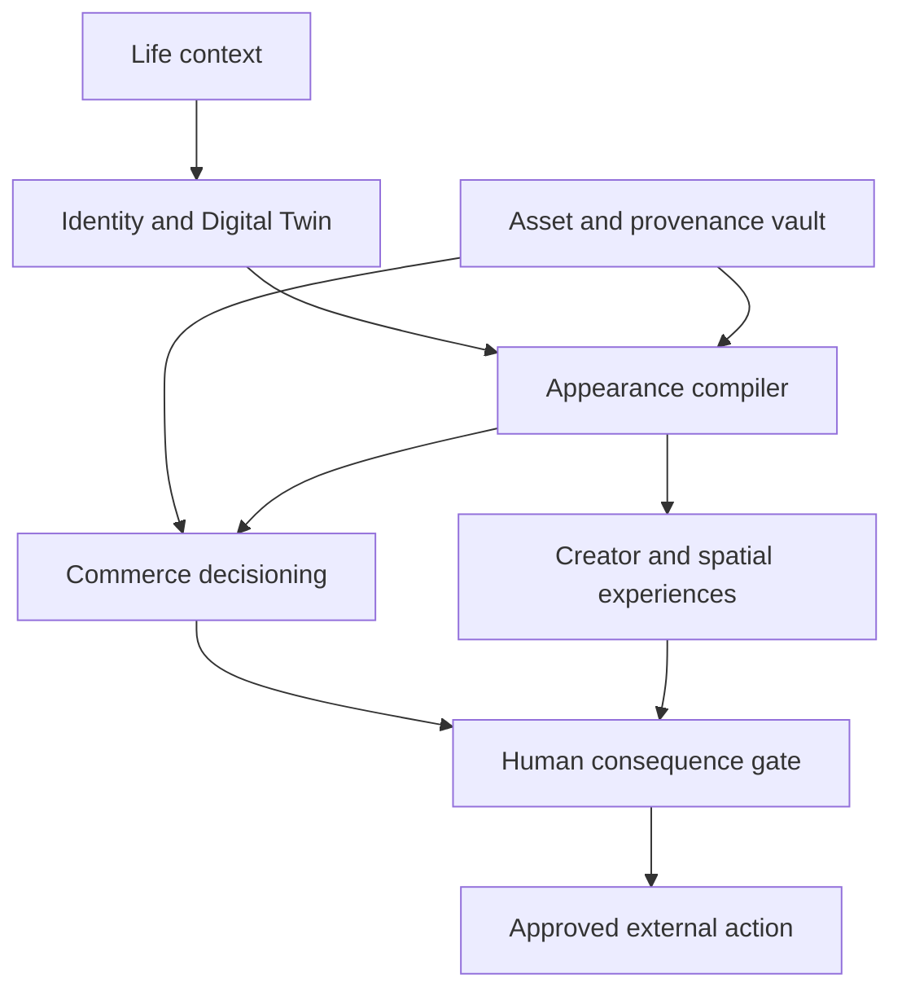

# Bounded Auto-Promotion Expansion Portfolio

Status: Draft addendum for written review  
Date: 2026-08-29  
Target branch: `iteration/bounded-auto-promotion`  
Parent specification: [Bounded Auto-Promotion Fashion Ecosystem](./2026-08-29-bounded-auto-promotion-design.md)  
Work item: `FIE-BA-EXP-001`

Advanced primitives: [Bounded Advanced Appearance Primitives](./2026-08-29-bounded-advanced-primitives.md)

## Strategic thesis

The bounded iteration expands Sovereign Closet from a fashion application into a governance-first Personal Identity OS. Clothing remains the first high-value vertical, while the underlying system coordinates identity, appearance, assets, life context, creator workflows, and approval-gated commerce.

The user remains governor and final decision-maker. Agents may observe authorized data, calculate, simulate, draft, monitor, and auto-promote proven internal policies. They do not check out, submit an offer, publish a listing or post, expose private identity data, install an external agent, or change a consequential permission without Human Authority.

## Product stack

The six expansion programs, in priority order, are:

1. **Wardrobe Capital and Liquidity** — Fashion CFO, asset values, resale, insurance, and purchase impact;
2. **Agentic Shopping and Negotiation** — objective-driven search, price monitoring, offer planning, and approval-gated execution;
3. **Product Passport and Provenance** — persistent product identity, authenticity screening, care, ownership, and rights;
4. **Spatial Appearance** — spatial closet, Mirror Mode, movement, try-on, and physical-store assistance;
5. **Creator and Personal Brand** — content packages, calendar, visual consistency, lookbooks, and shoot direction; and
6. **Identity Infrastructure** — scoped Identity API, privacy-preserving preference tokens, permissions, and specialist-agent interoperability.

Life-context and emotional-memory capabilities span all six programs rather than becoming a separate silo.

## Fifty-feature bounded disposition

Horizon labels are branch-local: `R1` is the first monetizable asset-intelligence release, `R2` adds approval-gated commerce, `R3` adds ambient identity planning, `R4` adds spatial and creator experiences, and `R5` exposes governed platform capabilities.

| # | Capability | Bounded implementation | Horizon |
| ---: | --- | --- | --- |
| 1 | Agentic Commerce Layer | Convert an approved objective into gaps, ranked products, impact scores, watched prices, and a local candidate basket; checkout requires a signed approval receipt | R2 |
| 2 | Price Negotiation / Offer Agent | Estimate market range and prepare opening, counter, and walk-away strategies; every outbound offer or message is approval-gated | R2 |
| 3 | Personal Fashion CFO | Track purchase basis, current estimate, depreciation, liquidity, cost per wear, outfit leverage, identity importance, replacement cost, and closet NAV with confidence ranges | R1 |
| 4 | Automated Resale / Closet Liquidity | Detect low-use or redundant assets and prepare a rebalancing plan, listing draft, price range, and marketplace comparison; publishing and acceptance require approval | R1 |
| 5 | Digital Product Passport | Store identifiers, materials, origin, care, repair, certification, authenticity evidence, ownership, and resale history in a versioned passport | R1 |
| 6 | Authenticity Intelligence | Screen labels, stitching, serials, hardware, geometry, materials, packaging, and seller signals with explicit evidence and uncertainty; never claim definitive authentication without authority | R1 |
| 7 | Ownership Provenance Graph | Record manufacturer-to-current-owner custody claims as evidence-linked edges without treating unverified marketplace assertions as fact | R1 |
| 8 | Insurance Vault | Preserve controlled photos, receipts, identifiers, valuations, condition, and service history and export a reviewable insurance or claim-evidence packet | R1 |
| 9 | Spatial Closet | Present owned, candidate, and future-state garments as navigable spatial racks; movement or cloth physics remains a later provider-backed capability | R4 |
| 10 | Mirror Mode | Offer live-camera outfit, substitution, progression-state, pose, and lighting guidance after explicit camera consent | R4 |
| 11 | Real-Time Outfit Overlay | Evaluate a garment as part of a complete compiled appearance system rather than an isolated try-on | R4 |
| 12 | Movement Twin | Derive consented gait, posture, garment-motion, trouser-break, footwear, chain, and bag observations and flag low-confidence inferences | R4 |
| 13 | Social Presence Simulator | Predict presentation signals such as authority, formality, approachability, creativity, and intensity as uncertain hypotheses, never objective judgments | R3 |
| 14 | Persona Runtime | Apply approved Founder, Date, Travel, Creative, Formal, Night, Fitness, Camera, Relaxed, or Public Appearance weight profiles to style and presentation | R3 |
| 15 | Calendar-Aware Appearance Planning | Pre-build an explainable weekly plan using authorized events, repetition, laundry, weather, travel, camera exposure, and availability | R3 |
| 16 | Automatic Morning Brief | Generate an on-device or private daily brief from authorized calendar, weather, availability, and persona context | R3 |
| 17 | Laundry and Availability State | Track clean, dirty, cleaners, repair, packed, loaned, sold, missing, and reserved states and exclude unavailable items from recommendations | R1 |
| 18 | Smart Hanger / NFC Layer | Resolve an approved NFC, QR, or RFID identifier to wear, care, purchase, value, and compatibility actions | R3 |
| 19 | Wear Logging Without Manual Input | Reconcile consented scans, camera detections, receipts, photos, and manual events into reviewable wear records | R1 |
| 20 | Compliment Intelligence | Keep private preference and optional external-response signals separate, user-weighted, and deletable | R3 |
| 21 | Creator Mode | Turn an approved look into draft still, crop, flat lay, reel plan, caption, tags, links, thumbnail, and lookbook artifacts | R4 |
| 22 | Autonomous Content Calendar | Propose a non-repetitive content schedule across garments, scenes, poses, personas, and progression levels; publishing remains gated | R4 |
| 23 | Personal Brand Consistency Engine | Measure palette, signatures, pose diversity, recognition, coherence, and style drift across authorized published assets | R4 |
| 24 | Automated Lookbook Publisher | Compile web, PDF, campaign-deck, catalog, and platform-specific draft packages; each public destination has an approval gate | R4 |
| 25 | Identity API | Expose explicitly consented style, size, color, silhouette, and commerce preferences through scoped, revocable read contracts | R5 |
| 26 | Privacy-Preserving Preference Token | Derive minimum-necessary style, fit, color, price, and brand vectors without exposing raw Twin, wardrobe, or body data | R5 |
| 27 | Agent Permission Ledger | Configure, version, and audit search, watch, basket, offer, purchase, sale, publish, data, and spend permissions with deny-by-default semantics | R1 |
| 28 | Fashion Agent Marketplace | Register sandboxed specialist agents with declared capabilities, evidence quality, cost, and permissions; installation and new access require approval | R5 |
| 29 | Expert vs AI Debate Mode | Show the evidence and disagreement among Style, Value, Trend, Fit, Provenance, and Risk agents instead of collapsing them into false certainty | R2 |
| 30 | Fashion Research Agent | Run an approved-source exploration queue through detected, researched, classified, tested, and accepted or rejected states | R2 |
| 31 | Designer Discovery Engine | Match latent design-language traits to unfamiliar designers while exposing why the match exists and how novel it is | R2 |
| 32 | Emerging Aesthetic Detection | Cluster authorized runway, product, and cultural signals, assign provisional internal labels, and require evidence before catalog adoption | R2 |
| 33 | Personal Trend Immunity | Separate historical affinity from trend boost and warn when hype rather than durable personal fit drives a recommendation | R2 |
| 34 | Trend Half-Life | Estimate popularity, velocity, likely peak, decline, and longevity with uncertainty and timeless, durable, seasonal, or spike labels | R2 |
| 35 | Weather Resilience Score | Multiply appearance utility by temperature, wind, precipitation, humidity, UV, terrain, and exposure viability | R3 |
| 36 | Thermal Outfit Model | Calculate explainable base, mid, and outer-layer needs from materials, insulation, wind, precipitation, activity, and comfort | R3 |
| 37 | Fragrance Layer | Match user-defined scent profiles to persona, look, occasion, weather, and time without making health claims | R3 |
| 38 | Grooming Scheduler | Coordinate presentation logistics for hair, beard, brows, skin, tattoo appearance, and wardrobe around events without medical advice | R3 |
| 39 | Photo Shoot Director | Generate camera, light, background, focal-length, pose, crop, and detail-shot guidance with optional live phone cues | R4 |
| 40 | Physical Store Copilot | Scan a candidate and return fit, compatibility, duplication, price, resale, outfits unlocked, and future-state impact as Buy / Maybe / Skip evidence—not an automatic purchase | R2 |
| 41 | Receipt-to-Closet | Extract an authorized receipt or email, match the catalog, create a draft owned-item record, and request only missing evidence | R1 |
| 42 | Closet OCR / Bulk Scan | Turn a consented rack, shoe-wall, or drawer capture into deduplicated draft inventory with confidence and review | R1 |
| 43 | Closet Reconstruction from Photos | Infer likely owned items, combinations, colors, silhouettes, and wear frequency from authorized history while preserving uncertainty | R1 |
| 44 | Relationship / Group Styling | Create temporary consented group contexts and complementary—not identity-flattening—looks for events, teams, casts, or couples | R4 |
| 45 | Group Visual Harmony | Balance palette, statement pieces, silhouette, and formality while retaining each participant's independent identity and preferences | R4 |
| 46 | Gift Intelligence | Reveal only user-permitted gaps, sizing, price, wishlist, and duplicate-avoidance signals to create useful gift candidates | R2 |
| 47 | Never Buy This Again | Convert returns, fit failures, material dislikes, sizing issues, and low-use outcomes into explainable future warnings | R1 |
| 48 | Clothing Memory | Attach private photos, places, people, events, and milestones to an item without forcing sentimental value into optimization | R3 |
| 49 | Timeline Playback | Reconstruct wardrobe, style vector, favorite looks, purchases, photos, and progression state for any supported date | R3 |
| 50 | Future-Self Simulator | Compare explicit Minimal Luxury, Dark Avant-Garde, Rap Luxury, Founder, and Hybrid scenario branches as exploratory—not deterministic—identity strategies | R3 |

## Thirty-layer recursive intelligence map

The second supplemental discovery pass is organized under the five immediate modules. These are interacting capabilities, not independent services.

| # | Recursive layer | Owning module | Bounded behavior |
| ---: | --- | --- | --- |
| 1 | Personal Style World Model | Wardrobe Graph / Gap Analyzer | Version identity, wardrobe, context, behavior, and market state as evidence-linked facts and beliefs; every proposed state transition is inspectable |
| 2 | Historical Style State Vector | Experiment / Meta-Learning Controller | Maintain time-series dimensions for aesthetic affinity, visual weight, logo tolerance, volume, jewelry, and novelty; behavior updates require evidence and confidence |
| 3 | Identity Delta Engine | Wardrobe Graph + Style Compiler | Compare current and explicitly approved target states and label established, partial, underdeveloped, overused, and missing capabilities |
| 4 | Outfit Counterfactual Engine | Outfit Counterfactual Engine | Change one declared factor against a fixed baseline, reject contaminated comparisons, and explain score deltas |
| 5 | Style Gradient Controls | Style Compiler | Translate continuous Quiet/Loud, Luxury/Street, Classic/Experimental, Tailored/Relaxed, Clean/Distressed, and similar controls into bounded Style IR mutations |
| 6 | Style Compiler | Style Compiler | Compile natural language and context into typed constraints, retrieval, optimization, prompt, and canon proof |
| 7 | Personal Uniform Discovery | Wardrobe Graph + Style Compiler | Mine stable high-performing outfit structures and generate context, season, and progression-safe variations for review |
| 8 | Wardrobe Graph Compression | Wardrobe Graph / Gap Analyzer | Classify core, specialist, novelty, and redundant nodes by compatible outfits, personas, seasons, and progression coverage |
| 9 | Closet Entropy | Wardrobe Graph / Gap Analyzer | Report coherence, exploration, and redundancy against a user-approved target band rather than minimizing diversity blindly |
| 10 | Style Coverage Map | Wardrobe Graph / Gap Analyzer | Visualize owned, saved, generated, and unexplored aesthetic territory with confidence and provenance |
| 11 | Context Simulator | Outfit Counterfactual Engine | Replay a compiled look across dates, meetings, galleries, travel, concerts, photography, weather, and other authorized contexts |
| 12 | Occasion Morphing | Style Compiler + Counterfactual Engine | Produce minimal-change day-to-dinner-to-night transitions with explicit additions, removals, and substitutions |
| 13 | Packing Intelligence | Wardrobe Graph + Style Compiler | Optimize context and outfit coverage per packed item while respecting carry limits, availability, weather, care, and repetition |
| 14 | Garment Lifecycle Intelligence | Purchase Impact Simulator | Join verified purchase, wear, pairing, condition, care, value, resale, and retirement events into a lifecycle report |
| 15 | Purchase Simulation | Purchase Impact Simulator | Insert a candidate virtually, enumerate viable looks, estimate redundancy, progression value, liquidity, and marginal cost per viable look |
| 16 | Identity Signature Detector | Style Compiler | Discover recurring visual motifs while keeping explicit canon anchors separate and immutable |
| 17 | Signature Strength vs Novelty | Style Compiler + Meta-Learning Controller | Optimize within context-specific familiar/novel bands and expose the anchor budget used by each look |
| 18 | Camera-Aware Styling | Style Compiler | Store frontal, profile, seated, walking, low-light, flash, and motion performance evidence for items and outfits |
| 19 | Scene and Outfit Co-Optimization | Style Compiler + Counterfactual Engine | Jointly select environment, lighting, pose, camera, and outfit rather than treating the scene as decorative afterthought |
| 20 | Pose Intelligence | Style Compiler | Match pose families to garment geometry, footwear, accessories, anatomy, and the standalone-image contract |
| 21 | Confidence-Adaptive Styling | Meta-Learning Controller | Recommend the strongest look inside a user-controlled comfort envelope and disclose any stretch dimension |
| 22 | Identity Progression Curriculum | Meta-Learning Controller | Sequence current comfort, adjacent stretch, adoption, new baseline, and next stretch without aging language or automatic real-world body claims |
| 23 | Autonomous Style Experiments | Experiment / Meta-Learning Controller | Generate bounded control and variants, but require deterministic replay, shadow evidence, and promotion thresholds |
| 24 | Multi-Objective Optimization | Style Compiler + Counterfactual Engine | Preserve separate objectives for appearance, value, distinction, comfort, versatility, longevity, trend, recognition, and wardrobe reuse |
| 25 | Style Pareto Frontier | Counterfactual Engine + Purchase Simulator | Display only non-dominated options for the selected objectives, with uncertainty and constraints visible |
| 26 | Autonomous Gap Discovery | Wardrobe Graph / Gap Analyzer | Run scheduled graph diagnostics and queue high-leverage bridge-piece findings for review |
| 27 | Product Substitution Engine | Wardrobe Graph + Style Compiler | Return exact, visual, budget, fit, quality, owned, and available-now substitutes with Outfit DNA similarity and tradeoffs |
| 28 | Style Provenance | All five modules | Retain origin, seed, mutation, rationale, evidence, model, compiler, graph, Twin, and policy versions for every result |
| 29 | Why Me? Explainability | Style Compiler | Explain a result using the user's actual accepted patterns, context, constraints, and controlled novelty—not generic fashion claims |
| 30 | Recursive Meta-Learning | Experiment / Meta-Learning Controller | Compare fixed learning-strategy candidates and propose policy changes; activation still follows bounded shadow and canary gates |

The world model distinguishes observations, user assertions, inferred beliefs, simulations, targets, and immutable constitutional facts. Generated imagery cannot by itself become evidence that a garment is owned, an event occurred, a physical trait changed, or a user preference exists.

## Branch-local data domains

This portfolio extends only the bounded schema lineage. Representative aggregates are:

- `owned_items`, `item_state_events`, `wear_events`, and `availability_reservations`;
- `personal_style_world_snapshots`, `style_state_vectors`, `style_state_observations`, and `identity_delta_reports`;
- `personal_uniforms`, `wardrobe_centrality_metrics`, `closet_entropy_snapshots`, and `style_coverage_maps`;
- `asset_cost_basis`, `asset_valuations`, `valuation_evidence`, and `closet_nav_snapshots`;
- `resale_candidates`, `listing_drafts`, `offer_strategies`, and `liquidity_plans`;
- `product_passports`, `external_identifiers`, `care_events`, `service_events`, and `condition_snapshots`;
- `authenticity_assessments`, `authenticity_signals`, `custody_claims`, and `insurance_packet_versions`;
- `commerce_objectives`, `shopping_candidates`, `price_watches`, `candidate_baskets`, and `purchase_approvals`;
- `personas`, `calendar_contexts`, `weather_contexts`, `appearance_plans`, and `morning_briefs`;
- `creator_packages`, `content_calendar_drafts`, `brand_scorecards`, and `publication_approvals`;
- `spatial_scenes`, `mirror_sessions`, `movement_observations`, and `store_scan_sessions`;
- `identity_api_grants`, `preference_tokens`, `agent_registrations`, and `permission_ledger_events`; and
- `memory_events`, `timeline_snapshots`, and `future_self_scenarios`.

Similar concepts in the autonomous branch use different schemas, migrations, policies, and runtime state.

## Consequence gates

| Operation | Default bounded behavior | Required authority |
| --- | --- | --- |
| Search approved sources and monitor prices | Automatic with receipts and configured limits | Existing connector permission |
| Create a local basket or resale plan | Automatic | None beyond authorized data scope |
| Create or modify a retailer-side cart | Disabled by default | Connector-specific Human Authority grant |
| Submit an offer, counteroffer, or seller message | Draft only | Human Authority for each outbound action or explicitly bounded campaign |
| Checkout, reserve, bid, or accept an offer | Never automatic | Human Authority at the exact terms and total |
| Publish a sale listing, lookbook, post, or campaign | Draft only | Human Authority per destination and artifact set |
| Share an Identity API field or token | Deny by default | Explicit scope, recipient, purpose, and expiry |
| Install a third-party agent or grant a new tool | Sandbox evaluation only | Human Authority before activation |
| Change spend, communication, publishing, or data authority | Not learnable | Human Authority |

Approvals are term-bound and expire when price, quantity, counterparty, destination, data scope, or material conditions change.

## First revenue release gate

`R1` must ship a sellable private Wardrobe Capital product before later horizons are considered release-complete. The paid entitlement combines:

- Personal Fashion CFO dashboard;
- Closet NAV and valuation-confidence report;
- purchase-impact and wardrobe-leverage analysis;
- resale and rebalancing opportunity report;
- product-passport and insurance-vault export; and
- premium private lookbook export from the immediate five-module package.

Release requires a working entitlement boundary, price and offer copy approved by Human Authority, billing and cancellation receipts, privacy and data-deletion controls, affiliate disclosure when applicable, and instrumentation for activation, paid conversion, retention, report use, and avoided-purchase or recovered-value outcomes. No purchase, sale, or public listing is required to prove the paid product.

## External dependency validation

The supplemental discovery input names current commerce, product-passport, spatial-computing, and virtual-try-on technologies. They remain architectural leads rather than verified dependencies. Before an implementation plan selects any external protocol or provider, it must verify the current official specification, availability, geographic scope, terms, pricing, data use, privacy behavior, deprecation status, and test environment.

Adapters must preserve branch-local contracts so a provider or protocol can be replaced without rewriting the Digital Twin, Style IR, wardrobe graph, authority ledger, or evidence history.

## Portfolio acceptance criteria

The bounded expansion portfolio is ready for implementation planning when:

1. all 50 capabilities have a branch-local disposition and horizon;
2. the immediate five-module package remains the first technical dependency;
3. `R1` has a testable paid entitlement and value metric;
4. every commerce, publishing, identity-sharing, and third-party-agent side effect maps to an explicit gate;
5. Digital Twin, provenance, and immutable identity requirements remain intact;
6. no full 3D cloth-physics dependency blocks the first three horizons; and
7. branch-isolation tests can detect autonomous schemas, policies, or learning artifacts.
