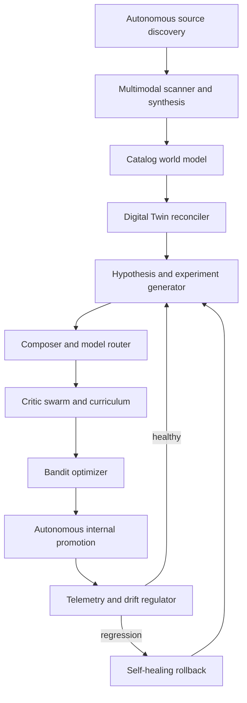
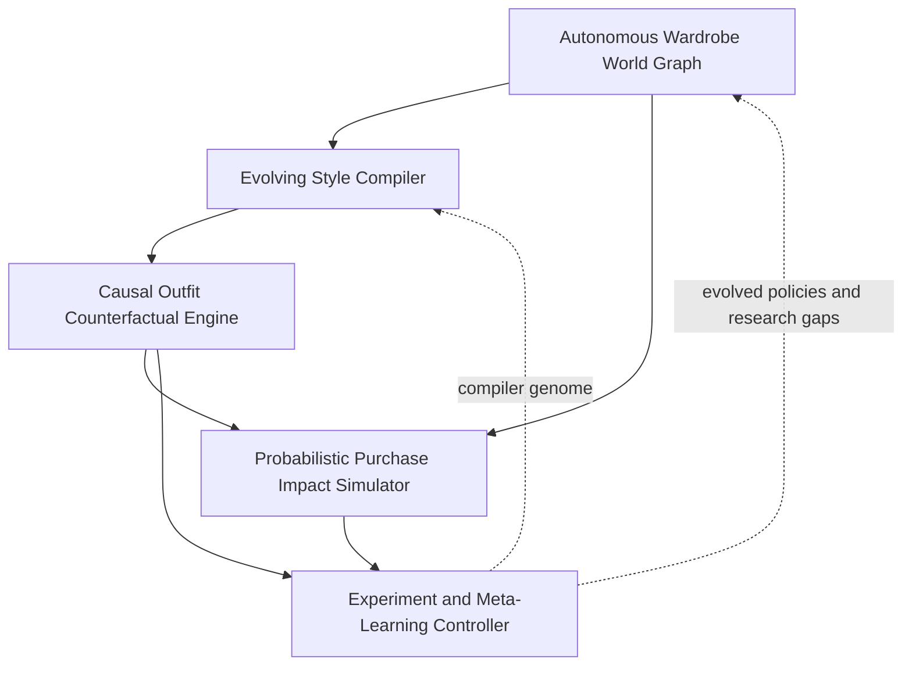

# Fully Autonomous Fashion Intelligence Ecosystem

Status: Approved architecture specification  
Date: 2026-08-29  
Target branch: `iteration/fully-autonomous`  
Work item: `FIE-FA-001`

Expansion addendum: [Fully Autonomous Expansion Portfolio](./2026-08-29-autonomous-expansion-portfolio.md)

## Product outcome

Create a continuously learning fashion intelligence system that researches new sources, expands and reconciles its own catalog world model, maintains a versioned Digital Twin, invents and evaluates styling hypotheses, evolves prompts and ranking policies, and autonomously promotes or reverses internal improvements.

The owner acts as supervisor and intervener rather than routine approver. The system owns the closed internal learning loop, while the immutable identity canon and the external authority boundary remain outside its power.

This is a separate product iteration, not a permissive configuration of bounded auto-promotion. It has its own code, schema, agents, policies, learning state, interface, tests, deployment, and operational receipts.

## Observable success

The first production-capable milestone succeeds when it can:

1. discover and qualify a previously unknown fashion source without a manually entered source record;
2. ingest multimodal content into an evolving, provenance-linked catalog world model;
3. repair a failed source adapter or quarantine the source without stopping the loop;
4. reconcile new evidence against a belief-based Digital Twin without weakening identity constraints;
5. generate its own outfit, prompt, routing, or scoring hypothesis;
6. construct an evaluation curriculum and run the hypothesis against replay, holdout, adversarial, and counterfactual cases;
7. allocate live internal traffic between champion and challenger policies;
8. autonomously promote the superior policy within its operating envelope;
9. detect drift or regression and self-rollback within one control cycle;
10. explain the complete causal chain in the Autonomy Observatory; and
11. complete another useful learning cycle using the evidence produced by the prior cycle.

## Non-goals for the first milestone

- a human approval queue for internal learning decisions;
- reuse of bounded-iteration schemas, promotion state, thresholds, or experiment history;
- autonomous spending, purchasing, production deployment, or public publishing;
- self-granting credentials, permissions, tools, compute, or budget;
- unrestricted collection of private or rights-unclear identity data;
- unsandboxed self-modification of application code;
- physical garment manufacturing; or
- replacing professional medical, fitness, tattoo, or body-modification advice.

## Canon conformance

This specification inherits the [Dual-Iteration Separation Contract](./2026-08-29-dual-iteration-separation-contract.md). Every generated result must preserve the same real adult identity without demographic substitution or age progression; use a terminal gauge goal of exactly 5 inches with tunnels or filled plugs; retain the established tattoos, monumental legible `RARE ONE` back composition, narrow sculpted beard, very thin mustache, eyebrow slit, rectangular black glasses, small nose piercing, signature chain, and pendant; and remain one standalone image rather than a collage or multi-panel composition.

Hair is short, dense black 360 waves. Blonde or red hair detailing is not added unless Human Authority explicitly requests it for a specific output. These constraints are non-learnable and cannot be weakened by reward optimization, critic consensus, or ontology evolution.

## Autonomous system architecture

The loop is event-driven and evidence-producing. Declarative policies, prompt genomes, routing policies, ontology versions, and internal catalog beliefs may evolve automatically. Hard canon constraints, authority boundaries, executable application deployment, connector permissions, and spend envelopes cannot.

## Immediate five-module implementation package

Supplemental DeepSeek thread material supplied by Human Authority on 2026-08-29 identifies five modules as the strongest next functional package. This branch implements them as one recursive learning substrate, with autonomous internal policy evolution and no dependency on full 3D cloth physics.

| Module | Autonomous responsibility | Primary artifacts | Constitutional limit |
| --- | --- | --- | --- |
| Evolving Style Compiler | Compile Twin beliefs, progression context, world-model facts, and a selected policy genome into typed Style IR, outfits, provider-ready prompts, and machine-verifiable constraint proofs | Style IR, policy lineage, compiled look, prompt genome, canon proof, uncertainty map | May evolve declarative compilation policy but never identity canon, output contract, provider authority, or executable application code |
| Causal Outfit Counterfactual Engine | Generate single-factor and interaction counterfactuals, estimate heterogeneous effects, search failure boundaries, and feed the most informative worlds into the curriculum | Counterfactual world, intervention graph, causal estimate, uncertainty, failure boundary | Counterfactual identity changes remain ineligible; simulated outcomes cannot be represented as observed facts |
| Autonomous Wardrobe Graph / Gap Analyzer | Maintain a temporal graph of owned, observed, desired, compatible, substitutable, and absent items; infer high-value gaps; create source-research tasks | Wardrobe belief graph, temporal coverage, gap hypothesis, sourcing agenda, confidence | May expand research autonomously only through allowed connectors; cannot assert ownership or make an acquisition without evidence |
| Probabilistic Purchase Impact Simulator | Forecast marginal wardrobe utility under price, availability, size, fit, redundancy, progression, trend decay, and preference uncertainty | Scenario distribution, expected coverage lift, regret, sensitivity analysis, acquisition priority | May rank and learn from scenarios but cannot buy, reserve, negotiate, message, or increase a spend envelope |
| Experiment / Meta-Learning Controller | Learn which hypothesis families, curricula, critics, counterfactuals, and exploration schedules improve the system; orchestrate recursive cycles and promote internal champions | Learning-strategy policy, experiment DAG, adaptive stopping rule, reward decomposition, autonomous promotion receipt | Hard constraints, authority boundaries, predeclared experiment rules, and intervention precedence are non-learnable |

The autonomous Style IR is a versioned semantic contract with the same minimum factual fields as the bounded branch, but its policy lineage, belief confidence, causal assumptions, exploration allocation, and critic requirements are first-class. Similar field names do not create a shared package or schema; each branch owns its implementation.

The Counterfactual Engine separates observation, intervention, and prediction. It can explore interaction effects and generate synthetic hard cases, but every artifact identifies which values were observed, inferred, or simulated. The meta-controller uses these artifacts to improve its learning strategy, not to manufacture positive evidence.

This package is accepted when the system autonomously detects a wardrobe gap, creates a research question, compiles a baseline, generates informative counterfactuals, estimates purchase impact, runs a self-authored experiment, promotes or rejects an internal challenger, and begins the next cycle from the resulting evidence—with zero external side effects.

## Constitutional control plane

The autonomous learning plane is enclosed by a non-learnable constitutional control plane. It validates every observation, hypothesis, experiment, decision, and side effect against:

- the immutable identity canon;
- source rights, privacy, retention, and provenance requirements;
- tool, connector, compute, and cost envelopes;
- reversible-operation requirements;
- external-side-effect prohibitions; and
- cryptographic branch and policy identity.

Learned evaluators may contribute evidence but cannot replace constitutional validators. A hard failure prevents activation, freezes the affected policy family, restores the last verified checkpoint, and creates an intervention event.

## Principal components

### Fashion Research Director

Maintains a persistent research agenda, identifies catalog gaps and emerging aesthetics, discovers candidate sources, allocates scan attention, and records why each source or question matters. It learns source usefulness but cannot expand connector or access authority.

### Autonomous Source Mesh

Runs bounded discovery workers across allowed connectors. Each worker captures source snapshots, content hashes, retrieval context, usage rights, confidence, and lineage. Source trust is continuously calibrated from extraction accuracy, freshness, conflict rate, and downstream utility.

### Catalog World Model

Represents products, garments, accessories, materials, silhouettes, brands, aesthetics, looks, sources, creators, occasions, climates, compatibility, availability, and temporal relationships as versioned entities and edges. It supports uncertainty, conflicting beliefs, temporal decay, and multiple competing interpretations.

The ontology can evolve through declarative proposals. A proposed concept or relationship must prove that it improves retrieval or evaluation without breaking replay compatibility before it becomes active. Executable database migrations remain a deployment action; runtime ontology versions are data.

### Digital Twin Belief Engine

Maintains probability-weighted beliefs about current measurements, physique, grooming, tattoos, piercings, jewelry, fit preferences, comfort, progression state, and visual identity anchors. New observations update confidence and create a new belief snapshot; they never silently overwrite history.

Hard identity attributes are projected from the constitutional canon and cannot be learned away. Private image references are isolated from ordinary catalog content and governed by purpose, rights, retention, and access records.

### Hypothesis Factory

Generates testable hypotheses from catalog gaps, reward decomposition, critic disagreement, drift, source novelty, failure clusters, and counterfactual simulations. It defines expected benefit, risk, evaluation population, stopping rule, cost estimate, and rollback checkpoint before execution.

### Prompt Genome and Outfit Composer

Treats composition strategies and prompt structures as versioned genomes with traceable parentage. It can mutate, recombine, or retire internal variants while preserving all 200 source prompts as immutable benchmark seeds. It composes standalone looks across the six identity-progression levels and may generate new capsules from the catalog world model.

### Contextual Model Router

Chooses an approved provider, model, prompt genome, evaluator set, and generation parameters for each context. Routing optimizes expected utility, latency, reliability, and cost inside an externally defined envelope. New providers or credentials require Human Authority.

### Critic Swarm

Uses independent critics for identity fidelity, anatomy, gauge geometry, tattoo continuity, outfit adherence, source fidelity, realism, cultural coherence, novelty, single-image compliance, provenance, cost, and failure risk. Critics disclose confidence and disagreement. No single learned critic can approve a hard constraint.

### Curriculum Builder

Continuously constructs evaluation sets from failures, rare contexts, hard negatives, policy boundary cases, prior regressions, and underrepresented progression levels. It prevents the system from improving only on easy or repetitive cases.

### Bandit Optimizer

Allocates eligible internal jobs across champion and challenger policies, balances exploration with regret control, and updates reward estimates from delayed human and automated evidence. Exploration is capped by novelty, cost, and risk budgets.

### Drift Regulator and Recovery Kernel

Monitors identity, catalog, source, evaluator, reward, latency, cost, and provider drift. It can reduce exploration, quarantine a source or critic, repair a declarative adapter, restore a checkpoint, rebuild derived state, and resume from an idempotent event offset.

## Twenty-five autonomous product features

1. Persistent fashion research agenda
2. Autonomous source discovery and qualification
3. Continuous multimodal content scanning
4. Self-healing declarative source adapters
5. Evolving fashion ontology proposals
6. Autonomous entity resolution and deduplication
7. Temporal catalog knowledge graph
8. Product lifecycle and trend-decay modeling
9. Adaptive source-trust and provenance ledger
10. Belief-based Digital Twin reconciliation
11. Confidence-aware identity memory
12. Counterfactual identity-progression simulation
13. Autonomous wardrobe-gap diagnosis
14. Generative capsule and complete-look architecture
15. Traceable prompt-genome evolution
16. Context-aware provider and model routing
17. Multi-critic visual evaluation swarm
18. Adversarial identity-canon red team
19. Self-building evaluation curriculum
20. Contextual-bandit outfit and policy optimization
21. Self-generated hypotheses and experiments
22. Novelty, diversity, and exploration budgets
23. Continuous drift detection and regulation
24. Autonomous internal promotion and self-rollback
25. Live Autonomy Observatory and intervention console

Commercial capabilities prepared by this iteration include continuously refreshed private lookbooks, affiliate-ready catalog intelligence, premium Digital Twin simulations, licensable non-identity prompt genomes, private trend briefings, and enterprise evaluation APIs. Transactions, offers, publishing, and customer-facing releases remain external actions.

## Agent society

| Agent | Autonomous mission | Hard limit |
| --- | --- | --- |
| Research Director | Set and revise the internal fashion research agenda | Allowed connectors only |
| Source Expansion Agent | Discover, rank, and schedule candidate sources | Cannot grant access or waive rights |
| Ontology Evolution Agent | Propose and replay-test new concepts and relations | Declarative ontology only |
| Twin Reconciler | Update Digital Twin beliefs from authorized evidence | Cannot alter constitutional identity facts |
| Hypothesis Generator | Create experiments from gaps, failures, and opportunities | Must define rollback and stopping rules |
| Composition Evolution Agent | Evolve outfits, capsules, and prompt genomes | Immutable seeds and canon remain fixed |
| Model Router | Allocate approved models and parameters | Fixed provider, cost, and tool envelope |
| Critic Swarm | Produce independent quality and risk evidence | Learned critics cannot waive hard checks |
| Bandit Optimizer | Allocate exploration and promote internal champions | Regret, novelty, and exposure caps |
| Drift Regulator | Detect change and adapt evaluation or traffic | Cannot expand authority |
| Recovery Kernel | Quarantine, restore, rebuild, and resume | Last verified checkpoints only |
| Constitutional Auditor | Enforce canon, authority, lineage, and receipts | Policy is non-learnable |

There is no human promotion agent or routine internal approval queue. Human Authority observes, pauses, constrains, or intervenes without becoming a required step in a healthy learning cycle.

## Independent data model

The autonomous branch starts its own migration line from the shared MVP. It does not import bounded-iteration tables or state.

- `autonomous_cycles`
- `research_agendas`
- `research_questions`
- `source_agents`
- `source_discoveries`
- `source_trust_models`
- `source_observations`
- `declarative_adapters`
- `catalog_beliefs`
- `catalog_entities`
- `catalog_relations`
- `wardrobe_belief_nodes`
- `wardrobe_belief_edges`
- `wardrobe_gap_hypotheses`
- `ontology_versions`
- `ontology_proposals`
- `provenance_claims`
- `twin_beliefs`
- `twin_observations`
- `twin_checkpoints`
- `hypotheses`
- `autonomous_experiments`
- `style_ir_artifacts`
- `compiled_style_artifacts`
- `counterfactual_worlds`
- `counterfactual_estimates`
- `purchase_impact_scenarios`
- `meta_learning_policies`
- `evaluation_curricula`
- `critic_observations`
- `policy_genomes`
- `prompt_genomes`
- `model_route_policies`
- `bandit_arms`
- `bandit_allocations`
- `reward_events`
- `drift_signals`
- `promotion_events`
- `recovery_events`
- `intervention_events`
- `constitutional_receipts`
- `autonomy_cost_events`

Every learning object carries branch identity, parent lineage, cycle ID, ontology version, policy version, evidence interval, confidence, cost, actor, constitutional status, and correlation ID. Event records are append-only. Derived world-model state can be reconstructed from verified checkpoints plus events.

## Adaptive utility model

For an eligible policy (a) in context (x) during cycle (t), the optimizer selects the action with the highest constrained value:

\[
J_t(a,x) = w_t^\top s(a,x) + \beta_t\sqrt{\frac{\ln N_t}{n_{a,t}}} + \lambda_t D(a,x) - R_t(a,x)
\]

Where:

- (s(a,x)) is the vector of identity, fit, compatibility, adherence, source quality, novelty, value, latency, cost, and preference evidence;
- (w_t) is the learned context-sensitive reward weighting;
- the square-root term is bounded exploration value;
- (D(a,x)) is diversity contribution; and
- (R_t(a,x)) is predicted risk and constraint proximity.

Selection is permitted only when the constitutional projection returns true:

\[
C_{canon} \land C_{rights} \land C_{authority} \land C_{budget} \land C_{reversibility} = \mathrm{true}
\]

Any hard-constraint failure forces the action to be ineligible, regardless of predicted reward. The system may learn (w_t), exploration rates, critic calibration, and policy genomes; it may not learn or optimize around the constitutional constraints.

## Autonomous promotion policy

A challenger may become the internal champion without human approval when the system has:

- passed every constitutional and standalone-image check;
- verified provenance and evaluation integrity;
- completed deterministic replay against all immutable benchmark seeds;
- passed the active failure curriculum and adversarial canon suite;
- demonstrated positive expected utility on a protected holdout interval;
- bounded downside under counterfactual and worst-cohort analysis;
- met the sequential confidence and minimum-evidence rule active at experiment start;
- stayed inside provider, latency, cost, novelty, and exploration envelopes;
- preserved a verified checkpoint and executable rollback path; and
- produced a complete causal promotion receipt.

Non-hard thresholds may adapt from calibration data, but a policy cannot lower its own predeclared stopping rule mid-experiment. Promotion activates only for eligible internal jobs. A hard failure, reward reversal, critic integrity failure, drift breach, unexplained cost excursion, or event-lineage break causes immediate traffic withdrawal and rollback.

## KPI framework

Primary KPIs:

1. expected accepted-look utility;
2. autonomous improvement velocity;
3. cumulative exploration regret; and
4. useful discovery yield.

Learning drivers:

- research-question resolution rate;
- source marginal utility;
- ontology contribution rate;
- critic calibration and disagreement resolution;
- reward lift by context and progression level;
- policy diversity without quality loss; and
- proportion of cycles completed without intervention.

Guardrails:

- hard-canon violations must remain zero;
- unauthorized external side effects must remain zero;
- catalog claims without provenance must remain isolated from active composition;
- protected-cohort and progression-level regressions must remain inside the constitutional envelope;
- mean and tail cost, latency, and failure rates must remain inside externally set limits;
- recovery mean time must remain below one control cycle; and
- intervention, rollback, and constitutional events must be reconstructable from append-only evidence.

## User experience

The product becomes an `Autonomy Observatory` with six primary surfaces:

1. **Live Topology** — active agents, cycles, policies, traffic, dependencies, and health;
2. **World Model** — catalog entities, beliefs, provenance, ontology evolution, and temporal confidence;
3. **Twin State** — Digital Twin beliefs, authorized observations, progression simulations, and protected canon;
4. **Evolution Lab** — hypotheses, policy and prompt genomes, curricula, bandit arms, and causal evidence;
5. **Drift and Recovery** — anomalies, quarantines, checkpoints, rollbacks, and resumed cycles;
6. **Intervention Console** — pause, kill, constrain, quarantine, restore, and revoke controls.

The interface uses the Rare One black-luxury foundation with violet, cold-metal, and cyan live-system signals. Motion communicates active learning but honors reduced-motion preferences. Every autonomous decision exposes intent, evidence, uncertainty, lineage, cost, and reversibility. The interface never disguises an automated inference as a user decision.

## Human intervention semantics

Human Authority can:

- pause all cycles or one policy family;
- freeze source discovery, ontology evolution, or exploration;
- quarantine a source, model, critic, policy, or event interval;
- lower cost, traffic, novelty, or risk envelopes;
- restore a verified checkpoint;
- revoke a connector or credential; and
- amend the identity canon through an explicit constitutional change.

An intervention is an append-only external event. The system cannot delete, override, reinterpret, or automatically reverse it. Resumption after a constitutional freeze requires Human Authority.

## Error handling and self-recovery

- Discovery failures lower source confidence and reschedule with exponential backoff inside the scan budget.
- Extraction conflicts remain simultaneous catalog beliefs until evidence resolves them.
- Adapter failures trigger sandboxed declarative repair tests; unsafe repairs quarantine the source.
- Ontology incompatibility replays against prior events before activation and falls back to the last compatible version.
- Critic collapse or correlated disagreement removes the critic from promotion evidence and rebuilds its calibration set.
- Provider failure reroutes only to already approved routes under the same idempotency and cost envelope.
- Reward delay preserves allocation lineage and prevents premature promotion.
- Drift breaches reduce exploration first, then freeze the affected policy family if the breach persists.
- Corrupt derived state is discarded and rebuilt from a verified checkpoint plus append-only events.
- Constitutional failure immediately stops the affected action, restores the champion, and requires an intervention receipt before resumption.

## Testing strategy

- unit and property tests for constitutional projection, event lineage, utility bounds, allocation, and recovery transitions;
- model-based tests for autonomous-cycle state machines and intervention precedence;
- simulation tests for bandit regret, delayed rewards, drift, source decay, and policy reversal;
- replay tests for all 200 immutable prompts across six progression levels;
- adversarial suites for identity drift, 5-inch gauge geometry, tattoo continuity, collage leakage, poisoned source content, prompt injection, and critic collusion;
- metamorphic tests ensuring ontology or prompt evolution preserves hard facts under paraphrase and reordering;
- chaos tests for connector, provider, database, evaluator, and checkpoint failures;
- counterfactual cohort tests for rare contexts and underrepresented progression levels;
- privacy, rights, retention, and credential-boundary tests;
- accessibility, reduced-motion, responsive-interface, and intervention-control tests;
- migration and event-rebuild tests for every branch-local schema version; and
- branch-isolation tests that reject bounded queues, gatekeeper states, fixed promotion tables, or shared learning artifacts.

## Initial milestone sequence

1. Establish the constitutional control plane, append-only event spine, and intervention semantics.
2. Build the Catalog World Model, source mesh with fixture discovery, and belief-based Digital Twin.
3. Build the Autonomous Wardrobe Graph / Gap Analyzer and the Evolving Style Compiler; replay all 200 immutable prompts across six progression levels.
4. Add the Causal Outfit Counterfactual Engine and Probabilistic Purchase Impact Simulator using non-billable fixtures.
5. Implement hypothesis generation, prompt genomes, critic swarm, curriculum construction, and the Experiment / Meta-Learning Controller.
6. Add simulation-trained contextual allocation, protected holdouts, and autonomous internal champion promotion.
7. Add drift regulation, checkpoint recovery, autonomous rollback, and full event reconstruction.
8. Prove multiple recursive improvement cycles in the Autonomy Observatory before enabling any external connector or paid provider.

## Release gate

The autonomous iteration can advance from local proof only after at least three complete fixture-based learning cycles independently discover, evaluate, promote, detect a seeded regression, recover, and resume with zero canon or authority violations. Simulation, replay, chaos, privacy, branch-isolation, accessibility, and event-reconstruction suites must be green.

Human Authority must still approve external connectors, credentials, billable providers, production deployment, public release, publishing, transactions, or any expansion of authority. Once those envelopes are established, internal research, evaluation, routing, promotion, and rollback operate without routine human approval.
